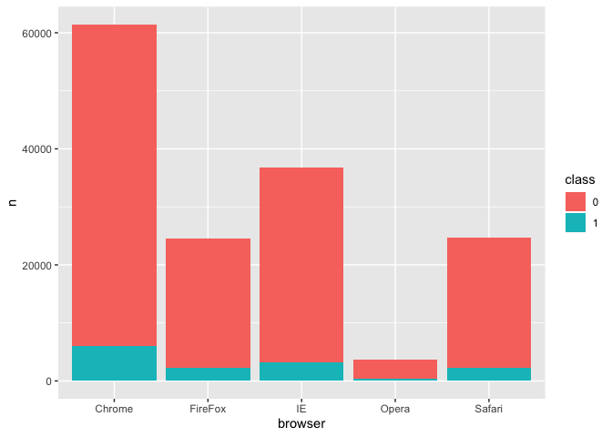
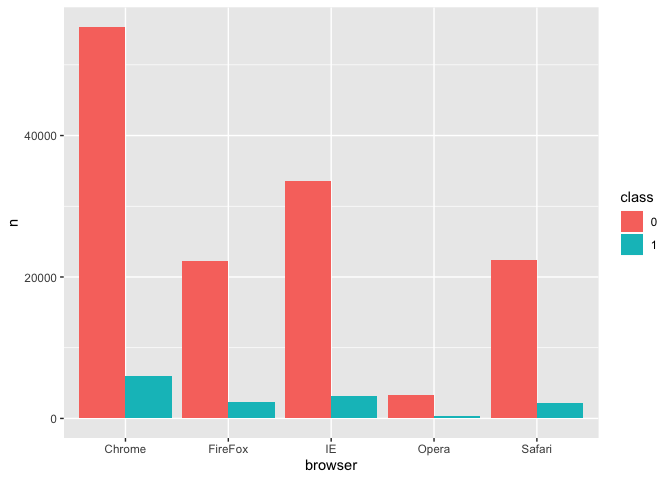
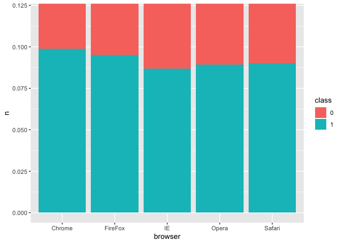

```r
Fraud_Data <- read_csv("Fraud/Fraud_Data.csv")
```

```
## Parsed with column specification:
## cols(
##   user_id = col_double(),
##   signup_time = col_datetime(format = ""),
##   purchase_time = col_datetime(format = ""),
##   purchase_value = col_double(),
##   device_id = col_character(),
##   source = col_character(),
##   browser = col_character(),
##   sex = col_character(),
##   age = col_double(),
##   ip_address = col_double(),
##   class = col_double()
## )
```

##Data exploration
###General exploration
Types of variables?

```r
names(Fraud_Data)
```

```
##  [1] "user_id"        "signup_time"    "purchase_time"  "purchase_value"
##  [5] "device_id"      "source"         "browser"        "sex"           
##  [9] "age"            "ip_address"     "class"
```
number of rows?

```r
nrow(Fraud_Data)
```

```
## [1] 151112
```
###How many Frauds?

```r
group_by(Fraud_Data, class) %>%
  count()
```

```
## # A tibble: 2 x 2
## # Groups:   class [2]
##   class      n
##   <dbl>  <int>
## 1     0 136961
## 2     1  14151
```
###Browser
Which browser has the most frauds?

```r
brow <- group_by(Fraud_Data, browser, class) %>%
  count() %>%
  ungroup() %>%
  mutate(class = as.factor(class))
brow
```

```
## # A tibble: 10 x 3
##    browser class     n
##    <chr>   <fct> <int>
##  1 Chrome  0     55363
##  2 Chrome  1      6069
##  3 FireFox 0     22268
##  4 FireFox 1      2342
##  5 IE      0     33540
##  6 IE      1      3187
##  7 Opera   0      3348
##  8 Opera   1       328
##  9 Safari  0     22442
## 10 Safari  1      2225
```

```r
ggplot(brow) +
  geom_bar(stat = "identity", aes(x = browser, y = n, fill = class))
```

<!-- -->


```r
ggplot(brow) +
  geom_bar(stat = "identity", aes(x = browser, y = n, fill = class), position = "dodge")
```

<!-- -->
This graph shows that Chrome has the most transactions (and frauds) than other browser.

Which browser has the biggest proportion of frauds?
table or graph

```r
ggplot(brow) +
  geom_bar(stat = "identity", aes(x = browser, y = n, fill = class), position = "fill") 
```

<!-- -->


```r
ggplot(brow) +
  geom_bar(stat = "identity", aes(x = browser, y = n, fill = class), position = "fill")  +
  coord_cartesian(ylim = c(0, 0.12))
```

<!-- -->

