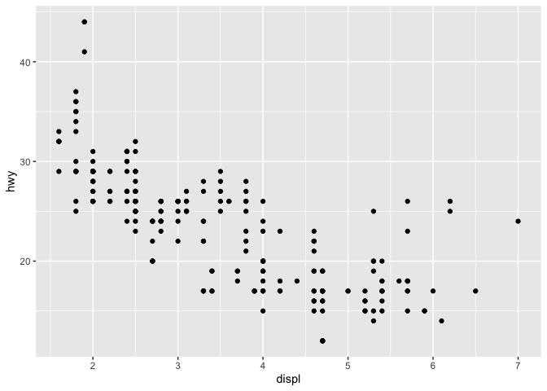
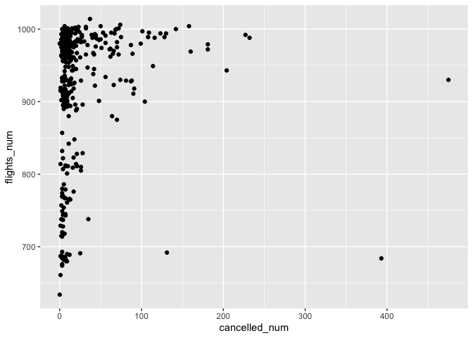
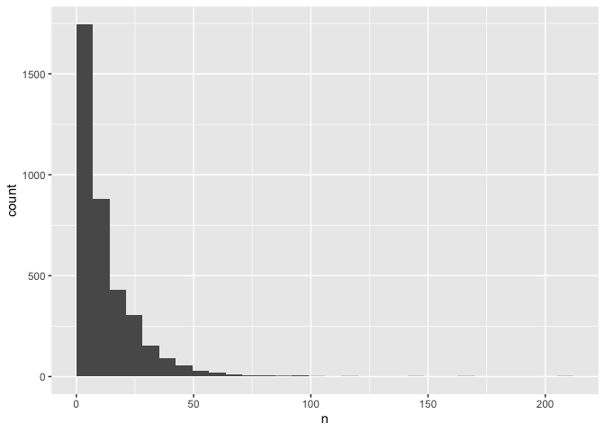

#Workflow: Basics
###1.

```r
my_variable <- 10
#my_var??able
```
Because the object called("my_var??able") is different from the object assigned("my_variable") with the value.
###2.

```r
ggplot(data = mpg) +
         geom_point(mapping = aes(x = displ, y = hwy))
```

<!-- -->
change "dota" to "data"

```r
filter(mpg, cyl == 8)
```

```
## # A tibble: 70 x 11
##    manufacturer model displ  year   cyl trans drv     cty   hwy fl    class
##    <chr>        <chr> <dbl> <int> <int> <chr> <chr> <int> <int> <chr> <chr>
##  1 audi         a6 q~   4.2  2008     8 auto~ 4        16    23 p     mids~
##  2 chevrolet    c150~   5.3  2008     8 auto~ r        14    20 r     suv  
##  3 chevrolet    c150~   5.3  2008     8 auto~ r        11    15 e     suv  
##  4 chevrolet    c150~   5.3  2008     8 auto~ r        14    20 r     suv  
##  5 chevrolet    c150~   5.7  1999     8 auto~ r        13    17 r     suv  
##  6 chevrolet    c150~   6    2008     8 auto~ r        12    17 r     suv  
##  7 chevrolet    corv~   5.7  1999     8 manu~ r        16    26 p     2sea~
##  8 chevrolet    corv~   5.7  1999     8 auto~ r        15    23 p     2sea~
##  9 chevrolet    corv~   6.2  2008     8 manu~ r        16    26 p     2sea~
## 10 chevrolet    corv~   6.2  2008     8 auto~ r        15    25 p     2sea~
## # ... with 60 more rows
```
change "fliter" to "filter"; change "=" to "=="

```r
filter(diamonds, carat > 3)
```

```
## # A tibble: 32 x 10
##    carat cut     color clarity depth table price     x     y     z
##    <dbl> <ord>   <ord> <ord>   <dbl> <dbl> <int> <dbl> <dbl> <dbl>
##  1  3.01 Premium I     I1       62.7    58  8040  9.1   8.97  5.67
##  2  3.11 Fair    J     I1       65.9    57  9823  9.15  9.02  5.98
##  3  3.01 Premium F     I1       62.2    56  9925  9.24  9.13  5.73
##  4  3.05 Premium E     I1       60.9    58 10453  9.26  9.25  5.66
##  5  3.02 Fair    I     I1       65.2    56 10577  9.11  9.02  5.91
##  6  3.01 Fair    H     I1       56.1    62 10761  9.54  9.38  5.31
##  7  3.65 Fair    H     I1       67.1    53 11668  9.53  9.48  6.38
##  8  3.24 Premium H     I1       62.1    58 12300  9.44  9.4   5.85
##  9  3.22 Ideal   I     I1       62.6    55 12545  9.49  9.42  5.92
## 10  3.5  Ideal   H     I1       62.8    57 12587  9.65  9.59  6.03
## # ... with 22 more rows
```
change "diamond" to "diamonds"
###3
"Alt-Shift-K" shows all the shortcuts; "Tools" --> "Keyboard Shortcuts Help"

#Data Transformation with dplyr
##Filter
###1

```r
flights
```

```
## # A tibble: 336,776 x 19
##     year month   day dep_time sched_dep_time dep_delay arr_time
##    <int> <int> <int>    <int>          <int>     <dbl>    <int>
##  1  2013     1     1      517            515         2      830
##  2  2013     1     1      533            529         4      850
##  3  2013     1     1      542            540         2      923
##  4  2013     1     1      544            545        -1     1004
##  5  2013     1     1      554            600        -6      812
##  6  2013     1     1      554            558        -4      740
##  7  2013     1     1      555            600        -5      913
##  8  2013     1     1      557            600        -3      709
##  9  2013     1     1      557            600        -3      838
## 10  2013     1     1      558            600        -2      753
## # ... with 336,766 more rows, and 12 more variables: sched_arr_time <int>,
## #   arr_delay <dbl>, carrier <chr>, flight <int>, tailnum <chr>,
## #   origin <chr>, dest <chr>, air_time <dbl>, distance <dbl>, hour <dbl>,
## #   minute <dbl>, time_hour <dttm>
```

```r
#?flights
```


```r
filter(flights, arr_delay > 120)
```

```
## # A tibble: 10,034 x 19
##     year month   day dep_time sched_dep_time dep_delay arr_time
##    <int> <int> <int>    <int>          <int>     <dbl>    <int>
##  1  2013     1     1      811            630       101     1047
##  2  2013     1     1      848           1835       853     1001
##  3  2013     1     1      957            733       144     1056
##  4  2013     1     1     1114            900       134     1447
##  5  2013     1     1     1505           1310       115     1638
##  6  2013     1     1     1525           1340       105     1831
##  7  2013     1     1     1549           1445        64     1912
##  8  2013     1     1     1558           1359       119     1718
##  9  2013     1     1     1732           1630        62     2028
## 10  2013     1     1     1803           1620       103     2008
## # ... with 10,024 more rows, and 12 more variables: sched_arr_time <int>,
## #   arr_delay <dbl>, carrier <chr>, flight <int>, tailnum <chr>,
## #   origin <chr>, dest <chr>, air_time <dbl>, distance <dbl>, hour <dbl>,
## #   minute <dbl>, time_hour <dttm>
```


```r
filter(flights, dest == "IAH" | dest == "HOU")
```

```
## # A tibble: 9,313 x 19
##     year month   day dep_time sched_dep_time dep_delay arr_time
##    <int> <int> <int>    <int>          <int>     <dbl>    <int>
##  1  2013     1     1      517            515         2      830
##  2  2013     1     1      533            529         4      850
##  3  2013     1     1      623            627        -4      933
##  4  2013     1     1      728            732        -4     1041
##  5  2013     1     1      739            739         0     1104
##  6  2013     1     1      908            908         0     1228
##  7  2013     1     1     1028           1026         2     1350
##  8  2013     1     1     1044           1045        -1     1352
##  9  2013     1     1     1114            900       134     1447
## 10  2013     1     1     1205           1200         5     1503
## # ... with 9,303 more rows, and 12 more variables: sched_arr_time <int>,
## #   arr_delay <dbl>, carrier <chr>, flight <int>, tailnum <chr>,
## #   origin <chr>, dest <chr>, air_time <dbl>, distance <dbl>, hour <dbl>,
## #   minute <dbl>, time_hour <dttm>
```


```r
filter(flights, carrier == "UA" | carrier == "AA" | carrier == "DA")
```

```
## # A tibble: 91,394 x 19
##     year month   day dep_time sched_dep_time dep_delay arr_time
##    <int> <int> <int>    <int>          <int>     <dbl>    <int>
##  1  2013     1     1      517            515         2      830
##  2  2013     1     1      533            529         4      850
##  3  2013     1     1      542            540         2      923
##  4  2013     1     1      554            558        -4      740
##  5  2013     1     1      558            600        -2      753
##  6  2013     1     1      558            600        -2      924
##  7  2013     1     1      558            600        -2      923
##  8  2013     1     1      559            600        -1      941
##  9  2013     1     1      559            600        -1      854
## 10  2013     1     1      606            610        -4      858
## # ... with 91,384 more rows, and 12 more variables: sched_arr_time <int>,
## #   arr_delay <dbl>, carrier <chr>, flight <int>, tailnum <chr>,
## #   origin <chr>, dest <chr>, air_time <dbl>, distance <dbl>, hour <dbl>,
## #   minute <dbl>, time_hour <dttm>
```


```r
filter(flights, month < 9 & month > 5)
```

```
## # A tibble: 86,995 x 19
##     year month   day dep_time sched_dep_time dep_delay arr_time
##    <int> <int> <int>    <int>          <int>     <dbl>    <int>
##  1  2013     6     1        2           2359         3      341
##  2  2013     6     1      451            500        -9      624
##  3  2013     6     1      506            515        -9      715
##  4  2013     6     1      534            545       -11      800
##  5  2013     6     1      538            545        -7      925
##  6  2013     6     1      539            540        -1      832
##  7  2013     6     1      546            600       -14      850
##  8  2013     6     1      551            600        -9      828
##  9  2013     6     1      552            600        -8      647
## 10  2013     6     1      553            600        -7      700
## # ... with 86,985 more rows, and 12 more variables: sched_arr_time <int>,
## #   arr_delay <dbl>, carrier <chr>, flight <int>, tailnum <chr>,
## #   origin <chr>, dest <chr>, air_time <dbl>, distance <dbl>, hour <dbl>,
## #   minute <dbl>, time_hour <dttm>
```


```r
filter(flights, arr_delay > 120 &! dep_delay > 0)
```

```
## # A tibble: 29 x 19
##     year month   day dep_time sched_dep_time dep_delay arr_time
##    <int> <int> <int>    <int>          <int>     <dbl>    <int>
##  1  2013     1    27     1419           1420        -1     1754
##  2  2013    10     7     1350           1350         0     1736
##  3  2013    10     7     1357           1359        -2     1858
##  4  2013    10    16      657            700        -3     1258
##  5  2013    11     1      658            700        -2     1329
##  6  2013     3    18     1844           1847        -3       39
##  7  2013     4    17     1635           1640        -5     2049
##  8  2013     4    18      558            600        -2     1149
##  9  2013     4    18      655            700        -5     1213
## 10  2013     5    22     1827           1830        -3     2217
## # ... with 19 more rows, and 12 more variables: sched_arr_time <int>,
## #   arr_delay <dbl>, carrier <chr>, flight <int>, tailnum <chr>,
## #   origin <chr>, dest <chr>, air_time <dbl>, distance <dbl>, hour <dbl>,
## #   minute <dbl>, time_hour <dttm>
```


```r
filter(flights, dep_delay >= 60 & air_time > 30)
```

```
## # A tibble: 26,657 x 19
##     year month   day dep_time sched_dep_time dep_delay arr_time
##    <int> <int> <int>    <int>          <int>     <dbl>    <int>
##  1  2013     1     1      811            630       101     1047
##  2  2013     1     1      826            715        71     1136
##  3  2013     1     1      848           1835       853     1001
##  4  2013     1     1      957            733       144     1056
##  5  2013     1     1     1114            900       134     1447
##  6  2013     1     1     1120            944        96     1331
##  7  2013     1     1     1301           1150        71     1518
##  8  2013     1     1     1337           1220        77     1649
##  9  2013     1     1     1400           1250        70     1645
## 10  2013     1     1     1505           1310       115     1638
## # ... with 26,647 more rows, and 12 more variables: sched_arr_time <int>,
## #   arr_delay <dbl>, carrier <chr>, flight <int>, tailnum <chr>,
## #   origin <chr>, dest <chr>, air_time <dbl>, distance <dbl>, hour <dbl>,
## #   minute <dbl>, time_hour <dttm>
```


```r
filter(flights, dep_time >= 0 & dep_time <= 600)
```

```
## # A tibble: 9,344 x 19
##     year month   day dep_time sched_dep_time dep_delay arr_time
##    <int> <int> <int>    <int>          <int>     <dbl>    <int>
##  1  2013     1     1      517            515         2      830
##  2  2013     1     1      533            529         4      850
##  3  2013     1     1      542            540         2      923
##  4  2013     1     1      544            545        -1     1004
##  5  2013     1     1      554            600        -6      812
##  6  2013     1     1      554            558        -4      740
##  7  2013     1     1      555            600        -5      913
##  8  2013     1     1      557            600        -3      709
##  9  2013     1     1      557            600        -3      838
## 10  2013     1     1      558            600        -2      753
## # ... with 9,334 more rows, and 12 more variables: sched_arr_time <int>,
## #   arr_delay <dbl>, carrier <chr>, flight <int>, tailnum <chr>,
## #   origin <chr>, dest <chr>, air_time <dbl>, distance <dbl>, hour <dbl>,
## #   minute <dbl>, time_hour <dttm>
```
###2
between() can be used to find values in an inclusive range;

```r
filter(flights, between(dep_time, 0, 600))
```

```
## # A tibble: 9,344 x 19
##     year month   day dep_time sched_dep_time dep_delay arr_time
##    <int> <int> <int>    <int>          <int>     <dbl>    <int>
##  1  2013     1     1      517            515         2      830
##  2  2013     1     1      533            529         4      850
##  3  2013     1     1      542            540         2      923
##  4  2013     1     1      544            545        -1     1004
##  5  2013     1     1      554            600        -6      812
##  6  2013     1     1      554            558        -4      740
##  7  2013     1     1      555            600        -5      913
##  8  2013     1     1      557            600        -3      709
##  9  2013     1     1      557            600        -3      838
## 10  2013     1     1      558            600        -2      753
## # ... with 9,334 more rows, and 12 more variables: sched_arr_time <int>,
## #   arr_delay <dbl>, carrier <chr>, flight <int>, tailnum <chr>,
## #   origin <chr>, dest <chr>, air_time <dbl>, distance <dbl>, hour <dbl>,
## #   minute <dbl>, time_hour <dttm>
```
###3
8255, arr_delay, dep_delay, arr_time, air_time

```r
filter(flights, is.na(dep_time))
```

```
## # A tibble: 8,255 x 19
##     year month   day dep_time sched_dep_time dep_delay arr_time
##    <int> <int> <int>    <int>          <int>     <dbl>    <int>
##  1  2013     1     1       NA           1630        NA       NA
##  2  2013     1     1       NA           1935        NA       NA
##  3  2013     1     1       NA           1500        NA       NA
##  4  2013     1     1       NA            600        NA       NA
##  5  2013     1     2       NA           1540        NA       NA
##  6  2013     1     2       NA           1620        NA       NA
##  7  2013     1     2       NA           1355        NA       NA
##  8  2013     1     2       NA           1420        NA       NA
##  9  2013     1     2       NA           1321        NA       NA
## 10  2013     1     2       NA           1545        NA       NA
## # ... with 8,245 more rows, and 12 more variables: sched_arr_time <int>,
## #   arr_delay <dbl>, carrier <chr>, flight <int>, tailnum <chr>,
## #   origin <chr>, dest <chr>, air_time <dbl>, distance <dbl>, hour <dbl>,
## #   minute <dbl>, time_hour <dttm>
```

```r
count(filter(flights, is.na(dep_time)))
```

```
## # A tibble: 1 x 1
##       n
##   <int>
## 1  8255
```
###4

```r
NA ^ 0
```

```
## [1] 1
```

```r
NA | TRUE
```

```
## [1] TRUE
```

```r
NA | FALSE
```

```
## [1] NA
```

```r
FALSE & NA
```

```
## [1] FALSE
```

```r
TRUE & NA
```

```
## [1] NA
```

##Arrange
###1
*Interesting*

```r
arrange(flights, desc(is.na(dep_time)), dep_time)
```

```
## # A tibble: 336,776 x 19
##     year month   day dep_time sched_dep_time dep_delay arr_time
##    <int> <int> <int>    <int>          <int>     <dbl>    <int>
##  1  2013     1     1       NA           1630        NA       NA
##  2  2013     1     1       NA           1935        NA       NA
##  3  2013     1     1       NA           1500        NA       NA
##  4  2013     1     1       NA            600        NA       NA
##  5  2013     1     2       NA           1540        NA       NA
##  6  2013     1     2       NA           1620        NA       NA
##  7  2013     1     2       NA           1355        NA       NA
##  8  2013     1     2       NA           1420        NA       NA
##  9  2013     1     2       NA           1321        NA       NA
## 10  2013     1     2       NA           1545        NA       NA
## # ... with 336,766 more rows, and 12 more variables: sched_arr_time <int>,
## #   arr_delay <dbl>, carrier <chr>, flight <int>, tailnum <chr>,
## #   origin <chr>, dest <chr>, air_time <dbl>, distance <dbl>, hour <dbl>,
## #   minute <dbl>, time_hour <dttm>
```
###2

```r
arrange(flights, desc(dep_delay))
```

```
## # A tibble: 336,776 x 19
##     year month   day dep_time sched_dep_time dep_delay arr_time
##    <int> <int> <int>    <int>          <int>     <dbl>    <int>
##  1  2013     1     9      641            900      1301     1242
##  2  2013     6    15     1432           1935      1137     1607
##  3  2013     1    10     1121           1635      1126     1239
##  4  2013     9    20     1139           1845      1014     1457
##  5  2013     7    22      845           1600      1005     1044
##  6  2013     4    10     1100           1900       960     1342
##  7  2013     3    17     2321            810       911      135
##  8  2013     6    27      959           1900       899     1236
##  9  2013     7    22     2257            759       898      121
## 10  2013    12     5      756           1700       896     1058
## # ... with 336,766 more rows, and 12 more variables: sched_arr_time <int>,
## #   arr_delay <dbl>, carrier <chr>, flight <int>, tailnum <chr>,
## #   origin <chr>, dest <chr>, air_time <dbl>, distance <dbl>, hour <dbl>,
## #   minute <dbl>, time_hour <dttm>
```


```r
arrange(flights, dep_delay)
```

```
## # A tibble: 336,776 x 19
##     year month   day dep_time sched_dep_time dep_delay arr_time
##    <int> <int> <int>    <int>          <int>     <dbl>    <int>
##  1  2013    12     7     2040           2123       -43       40
##  2  2013     2     3     2022           2055       -33     2240
##  3  2013    11    10     1408           1440       -32     1549
##  4  2013     1    11     1900           1930       -30     2233
##  5  2013     1    29     1703           1730       -27     1947
##  6  2013     8     9      729            755       -26     1002
##  7  2013    10    23     1907           1932       -25     2143
##  8  2013     3    30     2030           2055       -25     2213
##  9  2013     3     2     1431           1455       -24     1601
## 10  2013     5     5      934            958       -24     1225
## # ... with 336,766 more rows, and 12 more variables: sched_arr_time <int>,
## #   arr_delay <dbl>, carrier <chr>, flight <int>, tailnum <chr>,
## #   origin <chr>, dest <chr>, air_time <dbl>, distance <dbl>, hour <dbl>,
## #   minute <dbl>, time_hour <dttm>
```
###3

```r
arrange(flights, air_time)
```

```
## # A tibble: 336,776 x 19
##     year month   day dep_time sched_dep_time dep_delay arr_time
##    <int> <int> <int>    <int>          <int>     <dbl>    <int>
##  1  2013     1    16     1355           1315        40     1442
##  2  2013     4    13      537            527        10      622
##  3  2013    12     6      922            851        31     1021
##  4  2013     2     3     2153           2129        24     2247
##  5  2013     2     5     1303           1315       -12     1342
##  6  2013     2    12     2123           2130        -7     2211
##  7  2013     3     2     1450           1500       -10     1547
##  8  2013     3     8     2026           1935        51     2131
##  9  2013     3    18     1456           1329        87     1533
## 10  2013     3    19     2226           2145        41     2305
## # ... with 336,766 more rows, and 12 more variables: sched_arr_time <int>,
## #   arr_delay <dbl>, carrier <chr>, flight <int>, tailnum <chr>,
## #   origin <chr>, dest <chr>, air_time <dbl>, distance <dbl>, hour <dbl>,
## #   minute <dbl>, time_hour <dttm>
```
###4

```r
arrange(flights, desc(distance))
```

```
## # A tibble: 336,776 x 19
##     year month   day dep_time sched_dep_time dep_delay arr_time
##    <int> <int> <int>    <int>          <int>     <dbl>    <int>
##  1  2013     1     1      857            900        -3     1516
##  2  2013     1     2      909            900         9     1525
##  3  2013     1     3      914            900        14     1504
##  4  2013     1     4      900            900         0     1516
##  5  2013     1     5      858            900        -2     1519
##  6  2013     1     6     1019            900        79     1558
##  7  2013     1     7     1042            900       102     1620
##  8  2013     1     8      901            900         1     1504
##  9  2013     1     9      641            900      1301     1242
## 10  2013     1    10      859            900        -1     1449
## # ... with 336,766 more rows, and 12 more variables: sched_arr_time <int>,
## #   arr_delay <dbl>, carrier <chr>, flight <int>, tailnum <chr>,
## #   origin <chr>, dest <chr>, air_time <dbl>, distance <dbl>, hour <dbl>,
## #   minute <dbl>, time_hour <dttm>
```


```r
arrange(flights, distance)
```

```
## # A tibble: 336,776 x 19
##     year month   day dep_time sched_dep_time dep_delay arr_time
##    <int> <int> <int>    <int>          <int>     <dbl>    <int>
##  1  2013     7    27       NA            106        NA       NA
##  2  2013     1     3     2127           2129        -2     2222
##  3  2013     1     4     1240           1200        40     1333
##  4  2013     1     4     1829           1615       134     1937
##  5  2013     1     4     2128           2129        -1     2218
##  6  2013     1     5     1155           1200        -5     1241
##  7  2013     1     6     2125           2129        -4     2224
##  8  2013     1     7     2124           2129        -5     2212
##  9  2013     1     8     2127           2130        -3     2304
## 10  2013     1     9     2126           2129        -3     2217
## # ... with 336,766 more rows, and 12 more variables: sched_arr_time <int>,
## #   arr_delay <dbl>, carrier <chr>, flight <int>, tailnum <chr>,
## #   origin <chr>, dest <chr>, air_time <dbl>, distance <dbl>, hour <dbl>,
## #   minute <dbl>, time_hour <dttm>
```

##Select
###1

```r
select(flights, dep_time, dep_delay, arr_time, arr_delay)
```

```
## # A tibble: 336,776 x 4
##    dep_time dep_delay arr_time arr_delay
##       <int>     <dbl>    <int>     <dbl>
##  1      517         2      830        11
##  2      533         4      850        20
##  3      542         2      923        33
##  4      544        -1     1004       -18
##  5      554        -6      812       -25
##  6      554        -4      740        12
##  7      555        -5      913        19
##  8      557        -3      709       -14
##  9      557        -3      838        -8
## 10      558        -2      753         8
## # ... with 336,766 more rows
```

```r
select(flights, (dep_time:arr_delay))
```

```
## # A tibble: 336,776 x 6
##    dep_time sched_dep_time dep_delay arr_time sched_arr_time arr_delay
##       <int>          <int>     <dbl>    <int>          <int>     <dbl>
##  1      517            515         2      830            819        11
##  2      533            529         4      850            830        20
##  3      542            540         2      923            850        33
##  4      544            545        -1     1004           1022       -18
##  5      554            600        -6      812            837       -25
##  6      554            558        -4      740            728        12
##  7      555            600        -5      913            854        19
##  8      557            600        -3      709            723       -14
##  9      557            600        -3      838            846        -8
## 10      558            600        -2      753            745         8
## # ... with 336,766 more rows
```

```r
select(flights, -(year:day), -(carrier:time_hour))
```

```
## # A tibble: 336,776 x 6
##    dep_time sched_dep_time dep_delay arr_time sched_arr_time arr_delay
##       <int>          <int>     <dbl>    <int>          <int>     <dbl>
##  1      517            515         2      830            819        11
##  2      533            529         4      850            830        20
##  3      542            540         2      923            850        33
##  4      544            545        -1     1004           1022       -18
##  5      554            600        -6      812            837       -25
##  6      554            558        -4      740            728        12
##  7      555            600        -5      913            854        19
##  8      557            600        -3      709            723       -14
##  9      557            600        -3      838            846        -8
## 10      558            600        -2      753            745         8
## # ... with 336,766 more rows
```
###2

```r
select(flights, year, year)
```

```
## # A tibble: 336,776 x 1
##     year
##    <int>
##  1  2013
##  2  2013
##  3  2013
##  4  2013
##  5  2013
##  6  2013
##  7  2013
##  8  2013
##  9  2013
## 10  2013
## # ... with 336,766 more rows
```
That variable will only appear once.
###3

```r
vars <- c("year", "month", "day", "dep_delay", "arr_delay")
select(flights, one_of(vars))
```

```
## # A tibble: 336,776 x 5
##     year month   day dep_delay arr_delay
##    <int> <int> <int>     <dbl>     <dbl>
##  1  2013     1     1         2        11
##  2  2013     1     1         4        20
##  3  2013     1     1         2        33
##  4  2013     1     1        -1       -18
##  5  2013     1     1        -6       -25
##  6  2013     1     1        -4        12
##  7  2013     1     1        -5        19
##  8  2013     1     1        -3       -14
##  9  2013     1     1        -3        -8
## 10  2013     1     1        -2         8
## # ... with 336,766 more rows
```
It selects the variables in the vector and can be found in "flights"

```r
vars <- c("year", "month", "day", "dep_delay", "arr_delay", "time")
select(flights, one_of(vars))
```

```
## Warning: Unknown columns: `time`
```

```
## # A tibble: 336,776 x 5
##     year month   day dep_delay arr_delay
##    <int> <int> <int>     <dbl>     <dbl>
##  1  2013     1     1         2        11
##  2  2013     1     1         4        20
##  3  2013     1     1         2        33
##  4  2013     1     1        -1       -18
##  5  2013     1     1        -6       -25
##  6  2013     1     1        -4        12
##  7  2013     1     1        -5        19
##  8  2013     1     1        -3       -14
##  9  2013     1     1        -3        -8
## 10  2013     1     1        -2         8
## # ... with 336,766 more rows
```
###4

```r
select(flights, contains("TIME"))
```

```
## # A tibble: 336,776 x 6
##    dep_time sched_dep_time arr_time sched_arr_time air_time
##       <int>          <int>    <int>          <int>    <dbl>
##  1      517            515      830            819      227
##  2      533            529      850            830      227
##  3      542            540      923            850      160
##  4      544            545     1004           1022      183
##  5      554            600      812            837      116
##  6      554            558      740            728      150
##  7      555            600      913            854      158
##  8      557            600      709            723       53
##  9      557            600      838            846      140
## 10      558            600      753            745      138
## # ... with 336,766 more rows, and 1 more variable: time_hour <dttm>
```
It gives all the variables related to time even though no variable is called "TIME". They contains the word "time"

```r
select(flights, contains("TIME", ignore.case = FALSE))
```

```
## # A tibble: 336,776 x 0
```

##Mutate
###1

```r
transmute(flights, dep_time, time_in_min = dep_time %/% 100 * 60 + dep_time %% 100)
```

```
## # A tibble: 336,776 x 2
##    dep_time time_in_min
##       <int>       <dbl>
##  1      517         317
##  2      533         333
##  3      542         342
##  4      544         344
##  5      554         354
##  6      554         354
##  7      555         355
##  8      557         357
##  9      557         357
## 10      558         358
## # ... with 336,766 more rows
```
###2
air_time should equal to time. 

```r
transmute(flights, air_time, time = arr_time - dep_time)
```

```
## # A tibble: 336,776 x 2
##    air_time  time
##       <dbl> <int>
##  1      227   313
##  2      227   317
##  3      160   381
##  4      183   460
##  5      116   258
##  6      150   186
##  7      158   358
##  8       53   152
##  9      140   281
## 10      138   195
## # ... with 336,766 more rows
```
different units.

```r
transmute(flights, air_time, time = arr_time %/% 100 * 60 + arr_time %% 100 - dep_time %/% 100 *60 - dep_time %% 100)
```

```
## # A tibble: 336,776 x 2
##    air_time  time
##       <dbl> <dbl>
##  1      227   193
##  2      227   197
##  3      160   221
##  4      183   260
##  5      116   138
##  6      150   106
##  7      158   198
##  8       53    72
##  9      140   161
## 10      138   115
## # ... with 336,766 more rows
```
###3

```r
transmute(flights, sched_dep_time, dep_time, dep_delay, delay = dep_time %/% 100 *60 + dep_time %% 100 - sched_dep_time %/% 100 *60 - sched_dep_time %% 100)
```

```
## # A tibble: 336,776 x 4
##    sched_dep_time dep_time dep_delay delay
##             <int>    <int>     <dbl> <dbl>
##  1            515      517         2     2
##  2            529      533         4     4
##  3            540      542         2     2
##  4            545      544        -1    -1
##  5            600      554        -6    -6
##  6            558      554        -4    -4
##  7            600      555        -5    -5
##  8            600      557        -3    -3
##  9            600      557        -3    -3
## 10            600      558        -2    -2
## # ... with 336,766 more rows
```
###4
*interesting*

```r
df <- (flights, (desc(dep_delay))
 min_rank(df$dep_delay)
```
###5
it returns a string of length 10 w/ 1:3 cycled

```r
1:3 + 1:10
```

```
## Warning in 1:3 + 1:10: longer object length is not a multiple of shorter
## object length
```

```
##  [1]  2  4  6  5  7  9  8 10 12 11
```
###6
cos(x)
sin(x)
tan(x)

acos(x)
asin(x)
atan(x)
atan2(y, x)

cospi(x)
sinpi(x)
tanpi(x)

```r
?Trig
```

##Summarize
###1
*interesting*

```r
flight_delay_summary <- group_by(flights, flight) %>% summarise(num_flights = n(), percentage_on_time = sum(arr_time == sched_arr_time)/num_flights, percentage_early = sum(arr_time < sched_arr_time)/num_flights, percentage_15_mins_early = sum(sched_arr_time - arr_time == 15)/num_flights, percentage_late = sum(arr_time > sched_arr_time)/num_flights,percentage_15_mins_late = sum(arr_time - sched_arr_time == 15)/num_flights, percentage_2_hours_late = sum(arr_time - sched_arr_time == 120)/num_flights, rm.na = TRUE)
flight_delay_summary
```

```
## # A tibble: 3,844 x 9
##    flight num_flights percentage_on_t~ percentage_early percentage_15_m~
##     <int>       <int>            <dbl>            <dbl>            <dbl>
##  1      1         701         NA                 NA             NA      
##  2      2          51          0.0392             0.725          0.0392 
##  3      3         631         NA                 NA             NA      
##  4      4         393         NA                 NA             NA      
##  5      5         324          0.00617            0.716          0.00926
##  6      6         210         NA                 NA             NA      
##  7      7         237         NA                 NA             NA      
##  8      8         236         NA                 NA             NA      
##  9      9         153         NA                 NA             NA      
## 10     10          61          0.0164             0.721          0.0164 
## # ... with 3,834 more rows, and 4 more variables: percentage_late <dbl>,
## #   percentage_15_mins_late <dbl>, percentage_2_hours_late <dbl>,
## #   rm.na <lgl>
```

```r
flight_delay_summary %>% filter(percentage_15_mins_early == 0.5 & percentage_15_mins_late == 0.5)
```

```
## # A tibble: 0 x 9
## # ... with 9 variables: flight <int>, num_flights <int>,
## #   percentage_on_time <dbl>, percentage_early <dbl>,
## #   percentage_15_mins_early <dbl>, percentage_late <dbl>,
## #   percentage_15_mins_late <dbl>, percentage_2_hours_late <dbl>,
## #   rm.na <lgl>
```
###2

```r
not_cancelled <- flights %>%
filter(!is.na(dep_delay), !is.na(arr_delay))
not_cancelled %>%
  count(dest)
```

```
## # A tibble: 104 x 2
##    dest      n
##    <chr> <int>
##  1 ABQ     254
##  2 ACK     264
##  3 ALB     418
##  4 ANC       8
##  5 ATL   16837
##  6 AUS    2411
##  7 AVL     261
##  8 BDL     412
##  9 BGR     358
## 10 BHM     269
## # ... with 94 more rows
```

```r
not_cancelled %>%
  group_by(dest) %>%
  summarise(n = length(dest))
```

```
## # A tibble: 104 x 2
##    dest      n
##    <chr> <int>
##  1 ABQ     254
##  2 ACK     264
##  3 ALB     418
##  4 ANC       8
##  5 ATL   16837
##  6 AUS    2411
##  7 AVL     261
##  8 BDL     412
##  9 BGR     358
## 10 BHM     269
## # ... with 94 more rows
```


```r
not_cancelled %>%
  count(tailnum, wt = distance)
```

```
## # A tibble: 4,037 x 2
##    tailnum      n
##    <chr>    <dbl>
##  1 D942DN    3418
##  2 N0EGMQ  239143
##  3 N10156  109664
##  4 N102UW   25722
##  5 N103US   24619
##  6 N104UW   24616
##  7 N10575  139903
##  8 N105UW   23618
##  9 N107US   21677
## 10 N108UW   32070
## # ... with 4,027 more rows
```

```r
not_cancelled %>%
  group_by(tailnum) %>%
  summarise(n = sum(distance))
```

```
## # A tibble: 4,037 x 2
##    tailnum      n
##    <chr>    <dbl>
##  1 D942DN    3418
##  2 N0EGMQ  239143
##  3 N10156  109664
##  4 N102UW   25722
##  5 N103US   24619
##  6 N104UW   24616
##  7 N10575  139903
##  8 N105UW   23618
##  9 N107US   21677
## 10 N108UW   32070
## # ... with 4,027 more rows
```
###3
because arr_delay is more important
###4

```r
cancelled_day <- flights %>%
mutate(cancelled = (is.na(arr_delay) | is.na(dep_delay))) %>%
group_by(year, month, day) %>%
summarise(cancelled_num = sum(cancelled), flights_num = n())
cancelled_day
```

```
## # A tibble: 365 x 5
## # Groups:   year, month [12]
##     year month   day cancelled_num flights_num
##    <int> <int> <int>         <int>       <int>
##  1  2013     1     1            11         842
##  2  2013     1     2            15         943
##  3  2013     1     3            14         914
##  4  2013     1     4             7         915
##  5  2013     1     5             3         720
##  6  2013     1     6             3         832
##  7  2013     1     7             3         933
##  8  2013     1     8             7         899
##  9  2013     1     9             9         902
## 10  2013     1    10             3         932
## # ... with 355 more rows
```

```r
ggplot(cancelled_day) +
  geom_point(aes(x = cancelled_num, y = flights_num))
```

<!-- -->
###5

```r
flights %>%
  group_by(carrier) %>%
  summarize(arr_delay = mean(arr_delay, na.rm = TRUE)) %>%
  arrange(desc(arr_delay))
```

```
## # A tibble: 16 x 2
##    carrier arr_delay
##    <chr>       <dbl>
##  1 F9         21.9  
##  2 FL         20.1  
##  3 EV         15.8  
##  4 YV         15.6  
##  5 OO         11.9  
##  6 MQ         10.8  
##  7 WN          9.65 
##  8 B6          9.46 
##  9 9E          7.38 
## 10 UA          3.56 
## 11 US          2.13 
## 12 VX          1.76 
## 13 DL          1.64 
## 14 AA          0.364
## 15 HA         -6.92 
## 16 AS         -9.93
```
###6
*interesting*

```r
num_delay <- flights %>%
    group_by(tailnum) %>%
    arrange(time_hour) %>%
    mutate(yes = cumall(dep_delay < 60)) %>%
    filter(yes == TRUE) %>%
  tally(sort = TRUE) 
num_delay
```

```
## # A tibble: 3,747 x 2
##    tailnum     n
##    <chr>   <int>
##  1 N954UW    206
##  2 N952UW    163
##  3 N957UW    142
##  4 N5FAAA    117
##  5 N38727     99
##  6 N3742C     98
##  7 N5EWAA     98
##  8 N705TW     97
##  9 N765US     97
## 10 N29124     92
## # ... with 3,737 more rows
```

```r
ggplot(num_delay)+
  geom_histogram(mapping = aes(x = n), boundary = 0)
```

```
## `stat_bin()` using `bins = 30`. Pick better value with `binwidth`.
```

<!-- -->
###7
sort() to count() sort by descending order; it shows the most common group first.

##Grouping
###1
?
###2

```r
flights %>%
  group_by(tailnum) %>%
  summarise(arr_delay = mean(arr_delay)) %>%
  filter(min_rank(desc(arr_delay)) == 1)
```

```
## # A tibble: 1 x 2
##   tailnum arr_delay
##   <chr>       <dbl>
## 1 N844MH        320
```
###3

```r
flights %>%
  group_by(hour) %>%
  summarise(arr_delay = mean(arr_delay, na.rm = TRUE)) %>%
  arrange(arr_delay)
```

```
## # A tibble: 20 x 2
##     hour arr_delay
##    <dbl>     <dbl>
##  1     7    -5.30 
##  2     5    -4.80 
##  3     6    -3.38 
##  4     9    -1.45 
##  5     8    -1.11 
##  6    10     0.954
##  7    11     1.48 
##  8    12     3.49 
##  9    13     6.54 
## 10    14     9.20 
## 11    23    11.8  
## 12    15    12.3  
## 13    16    12.6  
## 14    18    14.8  
## 15    22    16.0  
## 16    17    16.0  
## 17    19    16.7  
## 18    20    16.7  
## 19    21    18.4  
## 20     1   NaN
```
###4

```r
flights %>%
  group_by(dest) %>%
  filter(!is.na(arr_delay)) %>%
  mutate(total_delay = sum(arr_delay), airline_delay = arr_delay / total_delay) %>%
  select(year:day, dest, arr_delay, total_delay, airline_delay) %>%
  arrange(dest, desc(airline_delay))
```

```
## # A tibble: 327,346 x 7
## # Groups:   dest [104]
##     year month   day dest  arr_delay total_delay airline_delay
##    <int> <int> <int> <chr>     <dbl>       <dbl>         <dbl>
##  1  2013     7    22 ABQ         153        1113        0.137 
##  2  2013    12    14 ABQ         149        1113        0.134 
##  3  2013    10    15 ABQ         138        1113        0.124 
##  4  2013     7    23 ABQ         137        1113        0.123 
##  5  2013    12    17 ABQ         136        1113        0.122 
##  6  2013     7    10 ABQ         126        1113        0.113 
##  7  2013     7    30 ABQ         118        1113        0.106 
##  8  2013     7    28 ABQ         117        1113        0.105 
##  9  2013    12     8 ABQ         114        1113        0.102 
## 10  2013     9     2 ABQ         109        1113        0.0979
## # ... with 327,336 more rows
```
###5

```r
lagged_delays <- flights %>%
  group_by(origin) %>%
  mutate(dep_lag = lag(dep_delay)) %>%
  filter(!is.na(dep_delay)) %>%
  group_by(origin, dep_lag) %>%
  summarise(dep_mean = mean(dep_delay)) %>%
  arrange(origin, dep_mean) 
lagged_delays
```

```
## # A tibble: 1,316 x 3
## # Groups:   origin [3]
##    origin dep_lag dep_mean
##    <chr>    <dbl>    <dbl>
##  1 EWR        -25    -11  
##  2 EWR        896    -10  
##  3 EWR        301     -9  
##  4 EWR        392     -9  
##  5 EWR        401     -9  
##  6 EWR        -23     -7.5
##  7 EWR        362     -7  
##  8 EWR        440     -6  
##  9 EWR        592     -6  
## 10 EWR        786     -6  
## # ... with 1,306 more rows
```
###6

```r
flights %>%
  group_by(dest) %>%
  mutate(speed = distance / air_time) %>%
  arrange(speed) %>%
  select(tailnum, distance, air_time, speed) 
```

```
## Adding missing grouping variables: `dest`
```

```
## # A tibble: 336,776 x 5
## # Groups:   dest [105]
##    dest  tailnum distance air_time speed
##    <chr> <chr>      <dbl>    <dbl> <dbl>
##  1 PHL   N755US        96       75  1.28
##  2 ACK   N328JB       199      141  1.41
##  3 PHL   N8932C        94       61  1.54
##  4 PHL   N832AY        94       59  1.59
##  5 PHL   N951UW        96       60  1.6 
##  6 PHL   N956UW        96       60  1.6 
##  7 PHL   N945UW        96       59  1.63
##  8 DCA   N745VJ       214      131  1.63
##  9 PHL   N953UW        96       57  1.68
## 10 PHL   N8631E        94       55  1.71
## # ... with 336,766 more rows
```


```r
flights %>%
  group_by(dest) %>%
  mutate(shortest = air_time - min(air_time, na.rm = T)) %>%
  arrange(air_time) %>%
  select(tailnum, sched_dep_time, sched_arr_time, shortest)
```

```
## Warning in min(air_time, na.rm = T): no non-missing arguments to min;
## returning Inf
```

```
## Adding missing grouping variables: `dest`
```

```
## # A tibble: 336,776 x 5
## # Groups:   dest [105]
##    dest  tailnum sched_dep_time sched_arr_time shortest
##    <chr> <chr>            <int>          <int>    <dbl>
##  1 BDL   N16911            1315           1411        0
##  2 BDL   N12167             527            628        0
##  3 BDL   N27200             851            954        1
##  4 PHL   N13913            2129           2224        0
##  5 BDL   N13955            1315           1411        1
##  6 PHL   N12921            2130           2225        0
##  7 BOS   N947UW            1500           1608        0
##  8 PHL   N8501F            1935           2056        0
##  9 BDL   N12160            1329           1426        1
## 10 BDL   N16987            2145           2246        1
## # ... with 336,766 more rows
```
###7

```r
flights %>%
  group_by(dest) %>%
  filter(n_distinct(carrier) > 2) %>%
  group_by(carrier) %>%
  summarise(n = n_distinct(dest)) %>%
  arrange(desc(n))
```

```
## # A tibble: 15 x 2
##    carrier     n
##    <chr>   <int>
##  1 DL         37
##  2 EV         36
##  3 UA         36
##  4 9E         35
##  5 B6         30
##  6 AA         17
##  7 MQ         17
##  8 WN          9
##  9 OO          5
## 10 US          5
## 11 VX          3
## 12 YV          3
## 13 FL          2
## 14 AS          1
## 15 F9          1
```


