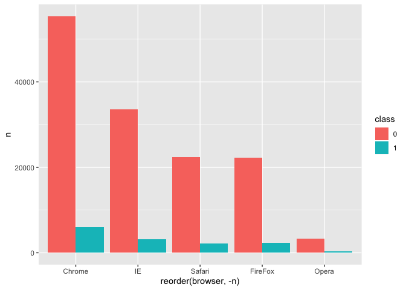
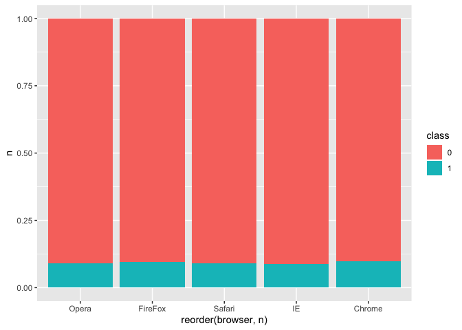
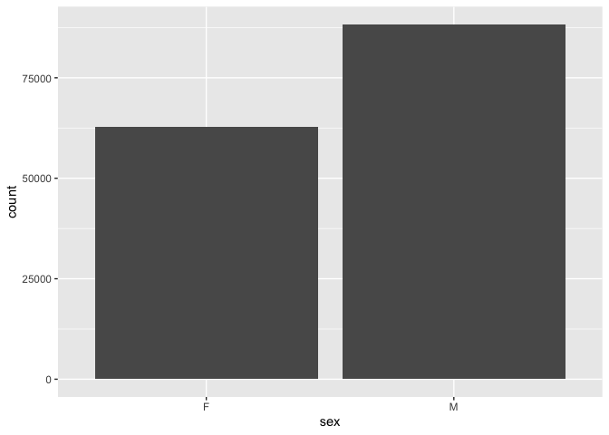
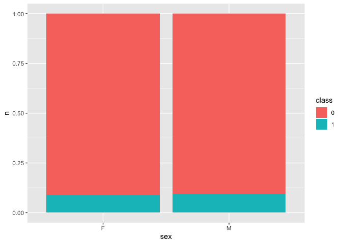
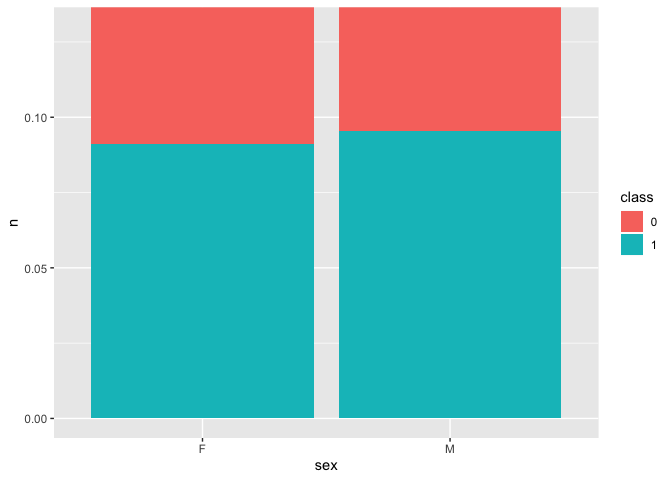
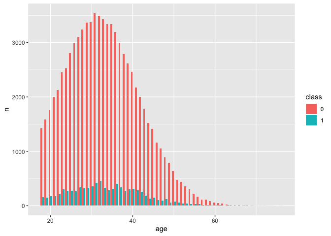
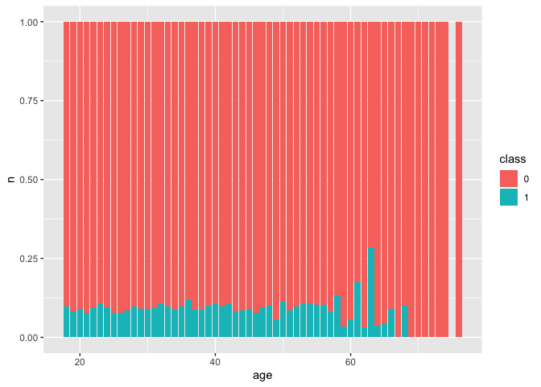
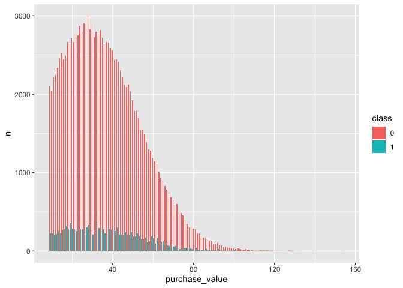
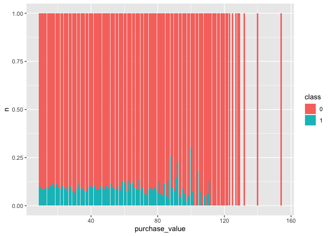

# Fraud Data Exploration
Import data:

```r
Fraud <- read_csv("Fraud/Fraud_Data.csv")
```

```
## Parsed with column specification:
## cols(
##   user_id = col_double(),
##   signup_time = col_datetime(format = ""),
##   purchase_time = col_datetime(format = ""),
##   purchase_value = col_double(),
##   device_id = col_character(),
##   source = col_character(),
##   browser = col_character(),
##   sex = col_character(),
##   age = col_double(),
##   ip_address = col_double(),
##   class = col_double()
## )
```

##General Info
Types of variables?

```r
names(Fraud)
```

```
##  [1] "user_id"        "signup_time"    "purchase_time"  "purchase_value"
##  [5] "device_id"      "source"         "browser"        "sex"           
##  [9] "age"            "ip_address"     "class"
```
Number of observation?

```r
nrow(Fraud)
```

```
## [1] 151112
```
How many frauds in total?

```r
group_by(Fraud, class) %>%
  count()
```

```
## # A tibble: 2 x 2
## # Groups:   class [2]
##   class      n
##   <dbl>  <int>
## 1     0 136961
## 2     1  14151
```
##Browsers
What types of browser?

```r
Browser <- select(Fraud, browser)
unique(Browser)
```

```
## # A tibble: 5 x 1
##   browser
##   <chr>  
## 1 Chrome 
## 2 Opera  
## 3 Safari 
## 4 IE     
## 5 FireFox
```
###Which browser has the most fraud?
Table:

```r
brow <- group_by(Fraud, browser, class) %>%
  count()%>%
  ungroup() %>%
  mutate(class = as.factor(class))
brow
```

```
## # A tibble: 10 x 3
##    browser class     n
##    <chr>   <fct> <int>
##  1 Chrome  0     55363
##  2 Chrome  1      6069
##  3 FireFox 0     22268
##  4 FireFox 1      2342
##  5 IE      0     33540
##  6 IE      1      3187
##  7 Opera   0      3348
##  8 Opera   1       328
##  9 Safari  0     22442
## 10 Safari  1      2225
```
Graphs:

```r
ggplot(brow) +
  geom_bar(stat = "identity", aes(x = reorder(browser, -n), y = n, fill = class), position = "dodge")
```

<!-- -->
###Which browser has the highest percentage of frauds?

```r
ggplot(brow) +
  geom_bar(stat = "identity", aes(x = reorder(browser, n), y = n, fill = class), position = "fill")
```

<!-- -->


```r
ggplot(brow) +
  geom_bar(stat = "identity", aes(x = reorder(browser, n), y = n, fill = class), position = "fill") +
  coord_cartesian(ylim = c(0, 0.15))
```

<!-- -->
So we can see that Chrome has the highest.
##Age and Sex
###General:
Age:

```r
Age <- select(Fraud, age)
summary(Age)
```

```
##       age       
##  Min.   :18.00  
##  1st Qu.:27.00  
##  Median :33.00  
##  Mean   :33.14  
##  3rd Qu.:39.00  
##  Max.   :76.00
```
Visualization

```r
ggplot(Fraud) +
  geom_histogram(aes(x = age, binwidth = 1))
```

```
## Warning: Ignoring unknown aesthetics: binwidth
```

```
## `stat_bin()` using `bins = 30`. Pick better value with `binwidth`.
```

<!-- -->
Sex: 

```r
Sex <- select(Fraud, sex)
group_by(Fraud, sex) %>%
  count()
```

```
## # A tibble: 2 x 2
## # Groups:   sex [2]
##   sex       n
##   <chr> <int>
## 1 F     62819
## 2 M     88293
```
Visualization

```r
ggplot(Fraud) +
  geom_bar(aes(x = sex))
```

<!-- -->
###Relation between Age and sex

```r
AgeSex <- select(Fraud, sex, age, class)
Maleage <- filter(AgeSex, sex == "M") %>%
  summary(age)
Femaleage <- filter(AgeSex, sex =="F") %>%
  summary(age)
Maleage
```

```
##      sex                 age            class        
##  Length:88293       Min.   :18.00   Min.   :0.00000  
##  Class :character   1st Qu.:27.00   1st Qu.:0.00000  
##  Mode  :character   Median :33.00   Median :0.00000  
##                     Mean   :33.17   Mean   :0.09552  
##                     3rd Qu.:39.00   3rd Qu.:0.00000  
##                     Max.   :72.00   Max.   :1.00000
```

```r
Femaleage
```

```
##      sex                 age           class        
##  Length:62819       Min.   :18.0   Min.   :0.00000  
##  Class :character   1st Qu.:27.0   1st Qu.:0.00000  
##  Mode  :character   Median :33.0   Median :0.00000  
##                     Mean   :33.1   Mean   :0.09101  
##                     3rd Qu.:39.0   3rd Qu.:0.00000  
##                     Max.   :76.0   Max.   :1.00000
```
Female has a lower mean, but the maximum is hight. Females experience 9.1% fraud, while males experience 9.6%.

Visualization

```r
ggplot(Fraud) +
  geom_boxplot(aes(x = sex, y = age))
```

<!-- -->
###Frauds distribution within sex & age groups
This shows the amount of frauds in each sex group.

```r
agesex <- group_by(Fraud, sex, age, class) %>%
  count()%>%
  ungroup() %>%
  mutate(class = as.factor(class))
ggplot(agesex) +
  geom_bar(stat = "identity", aes(x = sex, y = n, fill = class), position = "dodge")
```

<!-- -->
these graphs show the proportion of frauds in each sex group. Males have relatively more frauds.

```r
ggplot(agesex) +
  geom_bar(stat = "identity", aes(x = sex, y = n, fill = class), position = "fill")
```

<!-- -->


```r
ggplot(agesex) +
  geom_bar(stat = "identity", aes(x = sex, y = n, fill = class), position = "fill") +
  coord_cartesian(ylim = c(0, 0.13))
```

<!-- -->
This shows the number of frauds in each age group. 

```r
ggplot(agesex) +
  geom_bar(stat = "identity", aes(x = age, y = n, fill = class), position = "dodge") 
```

<!-- -->


```r
ggplot(agesex) +
  geom_bar(stat = "identity", aes(x = age, y = n, fill = class), position = "fill") 
```

<!-- -->
One age group has relatively high proportion. Which is..

```r
agefrauds <-group_by(Fraud, age, class) %>%
  count()%>%
  ungroup() %>%
  mutate(class = as.factor(class)) %>%
  filter(class == 1)
arrange(agefrauds, desc(n))
```

```
## # A tibble: 50 x 3
##      age class     n
##    <dbl> <fct> <int>
##  1    36 1       721
##  2    32 1       719
##  3    33 1       648
##  4    31 1       615
##  5    28 1       611
##  6    35 1       607
##  7    30 1       584
##  8    29 1       572
##  9    34 1       547
## 10    39 1       504
## # ... with 40 more rows
```
36.
if we just want to find which sex-age group has the highest frauds: 

```r
frauds <- filter(agesex, class == 1)
arrange(frauds, desc(n))
```

```
## # A tibble: 94 x 4
##    sex     age class     n
##    <chr> <dbl> <fct> <int>
##  1 M        32 1       459
##  2 M        31 1       418
##  3 M        36 1       402
##  4 M        30 1       358
##  5 M        27 1       342
##  6 M        37 1       335
##  7 M        33 1       332
##  8 M        29 1       330
##  9 F        36 1       319
## 10 M        28 1       319
## # ... with 84 more rows
```
male, 32
##Purchase value
###General
quick summary

```r
val <- group_by(Fraud, purchase_value, class) %>%
  count()%>%
  ungroup() %>%
  mutate(class = as.factor(class))
summary(val)
```

```
##  purchase_value   class         n          
##  Min.   :  9.00   0:122   Min.   :   1.00  
##  1st Qu.: 36.00   1: 98   1st Qu.:  29.75  
##  Median : 63.50           Median : 212.00  
##  Mean   : 64.45           Mean   : 686.87  
##  3rd Qu.: 91.00           3rd Qu.: 952.50  
##  Max.   :154.00           Max.   :2996.00
```


```r
ggplot(Fraud) +
  geom_histogram(aes(x = purchase_value))
```

```
## `stat_bin()` using `bins = 30`. Pick better value with `binwidth`.
```

<!-- -->
###Purchase value and frauds?

```r
ggplot(val) +
  geom_bar(stat = "identity", aes(x = purchase_value, y = n, fill = class), position = "dodge")
```

<!-- -->

```r
ggplot(val) +
  geom_bar(stat = "identity", aes(x = purchase_value, y = n, fill = class), position = "fill")
```

<!-- -->


```r
fraudss <- filter(val, class == 1)
arrange(fraudss, desc(n))
```

```
## # A tibble: 98 x 3
##    purchase_value class     n
##             <dbl> <fct> <int>
##  1             32 1       375
##  2             19 1       352
##  3             28 1       332
##  4             23 1       323
##  5             17 1       315
##  6             27 1       303
##  7             40 1       301
##  8             42 1       298
##  9             33 1       291
## 10             20 1       289
## # ... with 88 more rows
```
When the purchase value is 32 most frauds occur
