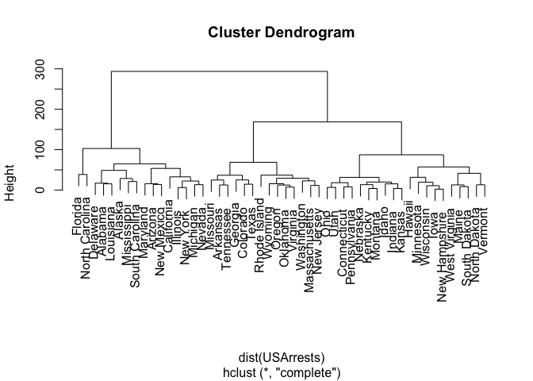
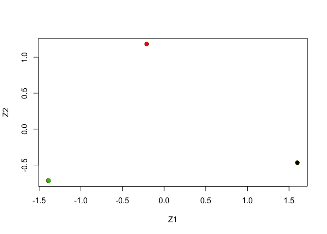

##Q7

correlation-based distance and Euclidean distance as dissimilarity measures for hierarchical clustering. It turns out that these two measures are almost equivalent : if each observation has been centered to have mean zero and standard deviation one,


```r
set.seed(321)
dsc <- scale(USArrests)
d1 <- dist(dsc)^2
d2 <- as.dist(1 - cor(t(dsc)))
summary(d2 / d1)
```

```
##     Min.  1st Qu.   Median     Mean  3rd Qu.     Max. 
## 0.000086 0.069135 0.133943 0.234193 0.262589 4.887686
```

##Q8

###a. sdev --> PVE


```r
pr.out <- prcomp(USArrests, scale = TRUE)
pr.var <- pr.out$sdev^2
pve <- pr.var / sum(pr.var)
pve
```

```
## [1] 0.62006039 0.24744129 0.08914080 0.04335752
```

###b. directly


```r
loadings <- pr.out$rotation
USArrests2 <- scale(USArrests)
sumvar <- sum(apply(as.matrix(USArrests2)^2, 2, sum))
apply((as.matrix(USArrests2) %*% loadings)^2, 2, sum) / sumvar
```

```
##        PC1        PC2        PC3        PC4 
## 0.62006039 0.24744129 0.08914080 0.04335752
```

##Q9

###a. hierarchical clustering with complete linkage and Euclidean distance


```r
set.seed(312)
hc.complete <- hclust(dist(USArrests), method = "complete")
plot(hc.complete)
```

<!-- -->

###b. cut tree


```r
cutree(hc.complete, 3)
```

```
##        Alabama         Alaska        Arizona       Arkansas     California 
##              1              1              1              2              1 
##       Colorado    Connecticut       Delaware        Florida        Georgia 
##              2              3              1              1              2 
##         Hawaii          Idaho       Illinois        Indiana           Iowa 
##              3              3              1              3              3 
##         Kansas       Kentucky      Louisiana          Maine       Maryland 
##              3              3              1              3              1 
##  Massachusetts       Michigan      Minnesota    Mississippi       Missouri 
##              2              1              3              1              2 
##        Montana       Nebraska         Nevada  New Hampshire     New Jersey 
##              3              3              1              3              2 
##     New Mexico       New York North Carolina   North Dakota           Ohio 
##              1              1              1              3              3 
##       Oklahoma         Oregon   Pennsylvania   Rhode Island South Carolina 
##              2              2              3              2              1 
##   South Dakota      Tennessee          Texas           Utah        Vermont 
##              3              2              2              3              3 
##       Virginia     Washington  West Virginia      Wisconsin        Wyoming 
##              2              2              3              3              2
```

###c. clustering after scaling


```r
sd.data <- scale(USArrests)
hc.complete.sd <- hclust(dist(sd.data), method = "complete")
plot(hc.complete.sd)
```

<!-- -->

###d. cut


```r
cutree(hc.complete.sd, 3)
```

```
##        Alabama         Alaska        Arizona       Arkansas     California 
##              1              1              2              3              2 
##       Colorado    Connecticut       Delaware        Florida        Georgia 
##              2              3              3              2              1 
##         Hawaii          Idaho       Illinois        Indiana           Iowa 
##              3              3              2              3              3 
##         Kansas       Kentucky      Louisiana          Maine       Maryland 
##              3              3              1              3              2 
##  Massachusetts       Michigan      Minnesota    Mississippi       Missouri 
##              3              2              3              1              3 
##        Montana       Nebraska         Nevada  New Hampshire     New Jersey 
##              3              3              2              3              3 
##     New Mexico       New York North Carolina   North Dakota           Ohio 
##              2              2              1              3              3 
##       Oklahoma         Oregon   Pennsylvania   Rhode Island South Carolina 
##              3              3              3              3              1 
##   South Dakota      Tennessee          Texas           Utah        Vermont 
##              3              1              2              3              3 
##       Virginia     Washington  West Virginia      Wisconsin        Wyoming 
##              3              3              3              3              3
```


```r
table(cutree(hc.complete, 3), cutree(hc.complete.sd, 3))
```

```
##    
##      1  2  3
##   1  6  9  1
##   2  2  2 10
##   3  0  0 20
```

scaling affects the clustering results.

##Q10 * review this part

###a. generate data


```r
set.seed(213)
x <- matrix(rnorm(20 * 3 * 50, mean = 0, sd = 0.001), ncol = 50)
x[1:20, 2] <- 1
x[21:40, 7] <- 1
x[21:40, 4] <- 2
x[41:60, 10] <- 2
true.labels <- c(rep(1, 20), rep(2, 20), rep(3, 20))
```

###b. PCA


```r
pr.out <- prcomp(x)
plot(pr.out$x[, 1:2], col = 1:3, xlab = "Z1", ylab = "Z2", pch = 19)
```

<!-- -->

###c. K-means, K=3


```r
km.out <- kmeans(x, 3, nstart = 20)
table(true.labels, km.out$cluster)
```

```
##            
## true.labels  1  2  3
##           1  0 20  0
##           2 20  0  0
##           3  0  0 20
```

Yes.

###d. K-means, K=2


```r
km.out <- kmeans(x, 2, nstart = 20)
table(true.labels, km.out$cluster)
```

```
##            
## true.labels  1  2
##           1 20  0
##           2  0 20
##           3 20  0
```

two clusters are combined into one.

###e. K=4


```r
km.out <- kmeans(x, 4, nstart = 20)
table(true.labels, km.out$cluster)
```

```
##            
## true.labels  1  2  3  4
##           1 20  0  0  0
##           2  0  0  0 20
##           3  0 14  6  0
```

One cluster is broken into two.

###f. K-means on the first two clusters


```r
km.out <- kmeans(pr.out$x[, 1:2], 3, nstart = 20)
table(true.labels, km.out$cluster)
```

```
##            
## true.labels  1  2  3
##           1 20  0  0
##           2  0 20  0
##           3  0  0 20
```

it works.

###g. K-means after scaling


```r
km.out <- kmeans(scale(x), 3, nstart = 20)
table(true.labels, km.out$cluster)
```

```
##            
## true.labels  1  2  3
##           1  0 17  3
##           2 19  0  1
##           3  0  6 14
```

doesn't work. Scaling affects distances.
