##Q7

###a. 


```r
set.seed(100)
train <- sample(1:dim(Boston), dim(Boston) / 2)
```

```
## Warning in 1:dim(Boston): numerical expression has 2 elements: only the
## first used
```

```r
Boston.train <- Boston[train, -14]
Boston.test <- Boston[-train, -14]
Y.train <- Boston[train, 14]
Y.test <- Boston[-train, 14]
```


```r
rf_boston_all <- randomForest(Boston.train, y = Y.train, xtest = Boston.test, ytest = Y.test, mtry = ncol(Boston) - 1, ntree = 500)
rf_boston_half <- randomForest(Boston.train, y = Y.train, xtest = Boston.test, ytest = Y.test, mtry = (ncol(Boston) - 1) / 2, ntree = 500)
rf_boston_sqrt <- randomForest(Boston.train, y = Y.train, xtest = Boston.test, ytest = Y.test, mtry = sqrt(ncol(Boston) - 1), ntree = 500)
```


```r
plot(1:500, rf_boston_all$test$mse, col = "green", type = "l", xlab = "Number of Trees", ylab = "Test MSE", ylim = c(10, 19)) 
lines(1:500, rf_boston_half$test$mse, col = "red", type = "l") 
lines(1:500, rf_boston_sqrt$test$mse, col = "blue", type = "l") 
legend("topright", c("m = p", "m = p/2", "m = sqrt(p)"), col = c("green", "red", "blue"), cex = 1, lty = 1)
```

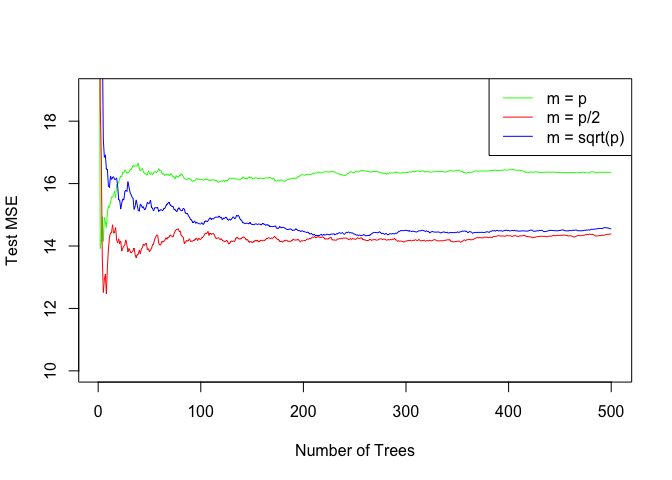<!-- -->

The test mse decreases as the # of trees increases. MSE also decreases as the # of predictors used. 

##Q8

###a. splitting


```r
set.seed(101)
train <- sample(1:nrow(Carseats), nrow(Carseats) / 2)
Carseats.train <- Carseats[train, ]
Carseats.test <- Carseats[-train, ]
```

###b. regression tree


```r
tree.carseats <- tree(Sales ~ ., data = Carseats.train)
summary(tree.carseats)
```

```
## 
## Regression tree:
## tree(formula = Sales ~ ., data = Carseats.train)
## Variables actually used in tree construction:
## [1] "ShelveLoc"   "Price"       "Income"      "Age"         "CompPrice"  
## [6] "Advertising"
## Number of terminal nodes:  16 
## Residual mean deviance:  1.992 = 366.4 / 184 
## Distribution of residuals:
##     Min.  1st Qu.   Median     Mean  3rd Qu.     Max. 
## -4.40700 -0.83470 -0.06182  0.00000  1.01300  3.09100
```

```r
plot(tree.carseats)
text(tree.carseats, pretty = 0)
```

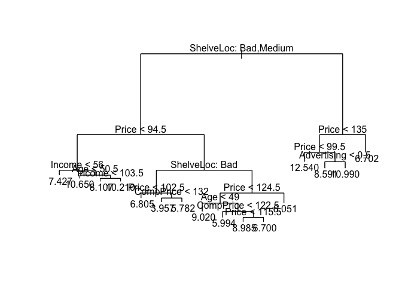<!-- -->


```r
yhat <- predict(tree.carseats, newdata = Carseats.test)
mean((yhat - Carseats.test$Sales)^2)
```

```
## [1] 4.276961
```

the test mse is 4.27.

###c. cross-validation


```r
set.seed(102)
cv.carseats <- cv.tree(tree.carseats, FUN=prune.tree)
cv.carseats
```

```
## $size
##  [1] 16 15 14 13 12 11 10  9  8  7  6  5  4  3  2  1
## 
## $dev
##  [1]  919.7856  909.6868  923.7513  952.4413  947.4505  913.9533  898.8801
##  [8]  910.2684  907.4252  952.3282  936.2497  936.2497 1027.3074 1084.1274
## [15] 1200.9081 1592.4036
## 
## $k
##  [1]      -Inf  15.90121  17.37402  21.28244  23.20544  26.48938  27.01610
##  [8]  33.06383  34.56000  44.44440  50.80477  54.45416  96.37349 123.12941
## [15] 193.32775 436.47475
## 
## $method
## [1] "deviance"
## 
## attr(,"class")
## [1] "prune"         "tree.sequence"
```

```r
tree.min <- 16- which.min(cv.carseats$dev)
plot(cv.carseats$size, cv.carseats$dev, type = "b")
points(tree.min, cv.carseats$dev[tree.min], col = "red", cex = 2, pch = 20)
```

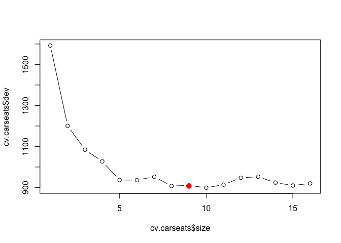<!-- -->


```r
prune.carseats <- prune.tree(tree.carseats, best = 9)
plot(prune.carseats)
text(prune.carseats, pretty = 0)
```

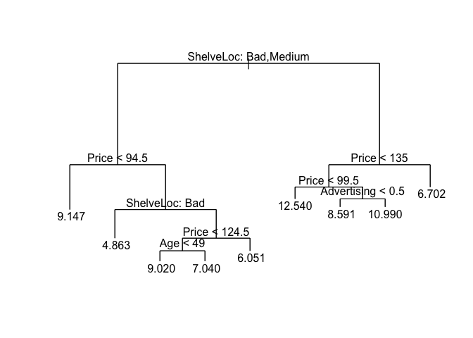<!-- -->


```r
yhat <- predict(prune.carseats, newdata = Carseats.test)
mean((yhat - Carseats.test$Sales)^2)
```

```
## [1] 4.638526
```

The MSE is 4.72

###d. bagging


```r
bag.carseats <- randomForest(Sales ~ ., data = Carseats.train, mtry = 10, ntree = 500, importance = TRUE)
yhat.bag <- predict(bag.carseats, newdata = Carseats.test)
mean((yhat.bag - Carseats.test$Sales)^2)
```

```
## [1] 2.753831
```

Bagging decreases the MSE quite a lot.


```r
importance(bag.carseats)
```

```
##                %IncMSE IncNodePurity
## CompPrice   21.1330508    127.383679
## Income       6.6658046     90.953727
## Advertising  9.6049156     77.652178
## Population  -2.3603536     52.033334
## Price       57.8776756    465.573327
## ShelveLoc   66.9333864    545.744447
## Age         12.8652104    115.553900
## Education    0.5383311     38.117686
## Urban       -2.1774710      4.618587
## US           1.8387400     11.001864
```

ShelveLoc is the most important one.

###e. random forest


```r
rf.carseats <- randomForest(Sales ~ ., data = Carseats.train, mtry = sqrt(ncol(Carseats)), ntree = 500, importance = TRUE)
yhat.rf <- predict(rf.carseats, newdata = Carseats.test)
mean((yhat.rf - Carseats.test$Sales)^2)
```

```
## [1] 3.278317
```

```r
importance(rf.carseats)
```

```
##               %IncMSE IncNodePurity
## CompPrice    8.856481     120.44012
## Income       4.675770     118.83756
## Advertising  8.550137     105.28074
## Population   2.449392     110.22528
## Price       39.769642     378.15869
## ShelveLoc   42.242905     389.21514
## Age          9.818126     150.70968
## Education    1.932109      69.44292
## Urban       -1.089291      11.52586
## US           2.340427      18.64256
```

In this case the test MSE is 3.23 while the ShelveLoc is still the most important predictor

##Q9

(ISLR does have many random datasets..


```r
head(OJ)
```

```
##   Purchase WeekofPurchase StoreID PriceCH PriceMM DiscCH DiscMM SpecialCH
## 1       CH            237       1    1.75    1.99   0.00    0.0         0
## 2       CH            239       1    1.75    1.99   0.00    0.3         0
## 3       CH            245       1    1.86    2.09   0.17    0.0         0
## 4       MM            227       1    1.69    1.69   0.00    0.0         0
## 5       CH            228       7    1.69    1.69   0.00    0.0         0
## 6       CH            230       7    1.69    1.99   0.00    0.0         0
##   SpecialMM  LoyalCH SalePriceMM SalePriceCH PriceDiff Store7 PctDiscMM
## 1         0 0.500000        1.99        1.75      0.24     No  0.000000
## 2         1 0.600000        1.69        1.75     -0.06     No  0.150754
## 3         0 0.680000        2.09        1.69      0.40     No  0.000000
## 4         0 0.400000        1.69        1.69      0.00     No  0.000000
## 5         0 0.956535        1.69        1.69      0.00    Yes  0.000000
## 6         1 0.965228        1.99        1.69      0.30    Yes  0.000000
##   PctDiscCH ListPriceDiff STORE
## 1  0.000000          0.24     1
## 2  0.000000          0.24     1
## 3  0.091398          0.23     1
## 4  0.000000          0.00     1
## 5  0.000000          0.00     0
## 6  0.000000          0.30     0
```

###a. splitting


```r
set.seed(102)
train <- sample(1:nrow(OJ), 800)
OJ.train <- OJ[train, ]
OJ.test <- OJ[-train, ]
```

###b. tree

```r
tree.oj <- tree(Purchase ~., data = OJ.train)
summary(tree.oj)
```

```
## 
## Classification tree:
## tree(formula = Purchase ~ ., data = OJ.train)
## Variables actually used in tree construction:
## [1] "LoyalCH"       "SalePriceMM"   "ListPriceDiff" "DiscMM"       
## [5] "PriceDiff"     "STORE"        
## Number of terminal nodes:  9 
## Residual mean deviance:  0.7356 = 581.9 / 791 
## Misclassification error rate: 0.155 = 124 / 800
```

training error is 0.7356; the number of terminal nodes is 9

###c. 


```r
tree.oj
```

```
## node), split, n, deviance, yval, (yprob)
##       * denotes terminal node
## 
##  1) root 800 1072.00 CH ( 0.607500 0.392500 )  
##    2) LoyalCH < 0.482304 306  338.50 MM ( 0.241830 0.758170 )  
##      4) LoyalCH < 0.276142 162  117.10 MM ( 0.117284 0.882716 ) *
##      5) LoyalCH > 0.276142 144  191.50 MM ( 0.381944 0.618056 )  
##       10) SalePriceMM < 2.04 77   83.74 MM ( 0.233766 0.766234 ) *
##       11) SalePriceMM > 2.04 67   92.15 CH ( 0.552239 0.447761 ) *
##    3) LoyalCH > 0.482304 494  444.10 CH ( 0.834008 0.165992 )  
##      6) LoyalCH < 0.753545 232  284.10 CH ( 0.698276 0.301724 )  
##       12) ListPriceDiff < 0.235 91  124.30 MM ( 0.428571 0.571429 )  
##         24) DiscMM < 0.15 48   63.51 CH ( 0.625000 0.375000 ) *
##         25) DiscMM > 0.15 43   44.12 MM ( 0.209302 0.790698 ) *
##       13) ListPriceDiff > 0.235 141  107.70 CH ( 0.872340 0.127660 )  
##         26) PriceDiff < 0.265 58   64.11 CH ( 0.758621 0.241379 ) *
##         27) PriceDiff > 0.265 83   32.06 CH ( 0.951807 0.048193 ) *
##      7) LoyalCH > 0.753545 262   97.44 CH ( 0.954198 0.045802 )  
##       14) STORE < 1.5 144   11.93 CH ( 0.993056 0.006944 ) *
##       15) STORE > 1.5 118   73.14 CH ( 0.906780 0.093220 ) *
```

num. 4 is a terminal node, whose splitting criterion is 0.482304. 162 observations are in this node; their deviance is 117.10. The overall prediction where is MM, whil 11.7% of observation is CH.

###d. plotting


```r
plot(tree.oj)
text(tree.oj)
```

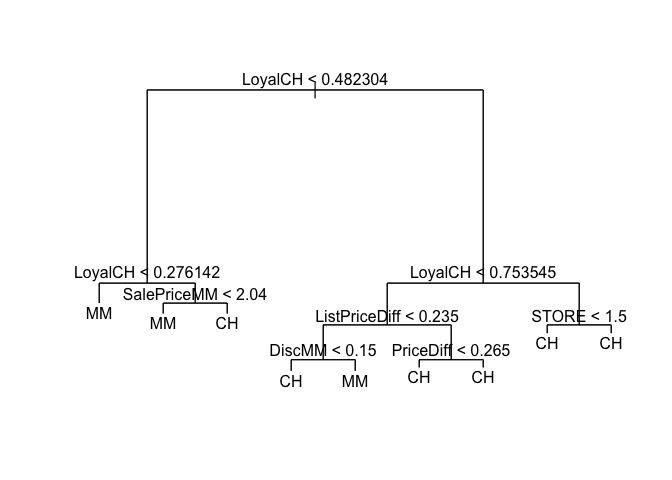<!-- -->

###e. predict


```r
tree.pred <- predict(tree.oj, OJ.test, type = "class")
table(tree.pred, OJ.test$Purchase)
```

```
##          
## tree.pred  CH  MM
##        CH 148  30
##        MM  19  73
```


```r
1 - (148+73)/(148+30+19+73)
```

```
## [1] 0.1814815
```

The test error rate is 0.182

###f. cross-validation


```r
cv.oj <- cv.tree(tree.oj, FUN = prune.misclass)
cv.oj
```

```
## $size
## [1] 9 7 5 2 1
## 
## $dev
## [1] 147 147 151 167 314
## 
## $k
## [1]       -Inf   0.000000   3.500000   8.333333 158.000000
## 
## $method
## [1] "misclass"
## 
## attr(,"class")
## [1] "prune"         "tree.sequence"
```

###g. plot


```r
set.seed(103)
plot(cv.oj$size, cv.oj$dev, type = "b")
tree.min <- which.min(cv.oj$dev)
points(cv.oj$size[tree.min], cv.oj$dev[tree.min], col = "red", cex = 2, pch = 20)
```

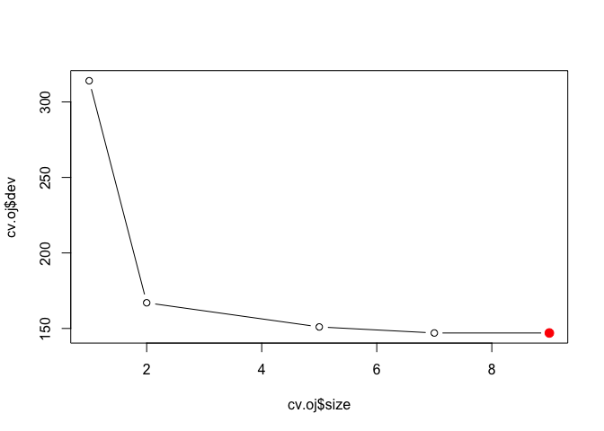<!-- -->

###h.

From the plot, the tree with node 9 or 7.

###i. pruning


```r
prune.oj <- prune.misclass(tree.oj, best = 7)
plot(prune.oj)
text(prune.oj, pretty = 0)
```

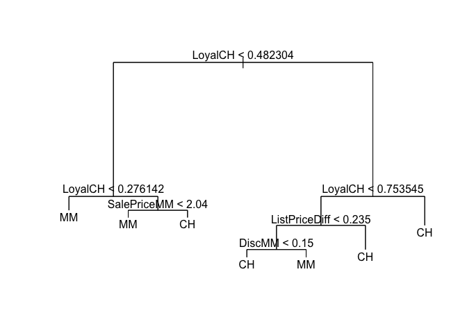<!-- -->

###j. comparing


```r
summary(tree.oj)
```

```
## 
## Classification tree:
## tree(formula = Purchase ~ ., data = OJ.train)
## Variables actually used in tree construction:
## [1] "LoyalCH"       "SalePriceMM"   "ListPriceDiff" "DiscMM"       
## [5] "PriceDiff"     "STORE"        
## Number of terminal nodes:  9 
## Residual mean deviance:  0.7356 = 581.9 / 791 
## Misclassification error rate: 0.155 = 124 / 800
```


```r
summary(prune.oj)
```

```
## 
## Classification tree:
## snip.tree(tree = tree.oj, nodes = c(7L, 13L))
## Variables actually used in tree construction:
## [1] "LoyalCH"       "SalePriceMM"   "ListPriceDiff" "DiscMM"       
## Number of terminal nodes:  7 
## Residual mean deviance:  0.7639 = 605.8 / 793 
## Misclassification error rate: 0.155 = 124 / 800
```

###k. comparing error rate


```r
prune.pred <- predict(prune.oj, OJ.test, type = "class")
table(prune.pred, OJ.test$Purchase)
```

```
##           
## prune.pred  CH  MM
##         CH 148  30
##         MM  19  73
```


```r
(30+19)/(148+30+19+73)
```

```
## [1] 0.1814815
```

they are the same..?
which makes sense, since the pruning did not really prune.

##Q10

###a. removing NAs


```r
Hitters <- na.omit(Hitters)
Hitters$Salary <- log(Hitters$Salary)
```

###b. splitting


```r
train <- 1:200
Hitters.train <- Hitters[train, ]
Hitters.test <- Hitters[-train, ]
```

###c. boosting


```r
set.seed(104)
pows <- seq(-10, -0.2, by = 0.1)
lambdas <- 10^pows
train.err <- rep(NA, length(lambdas))
for (i in 1:length(lambdas)) {
    boost.hitters <- gbm(Salary ~ ., data = Hitters.train, distribution = "gaussian", n.trees = 1000, shrinkage = lambdas[i])
    pred.train <- predict(boost.hitters, Hitters.train, n.trees = 1000)
    train.err[i] <- mean((pred.train - Hitters.train$Salary)^2)
}
plot(lambdas, train.err, type = "b", xlab = "Shrinkage values", ylab = "Training MSE")
```

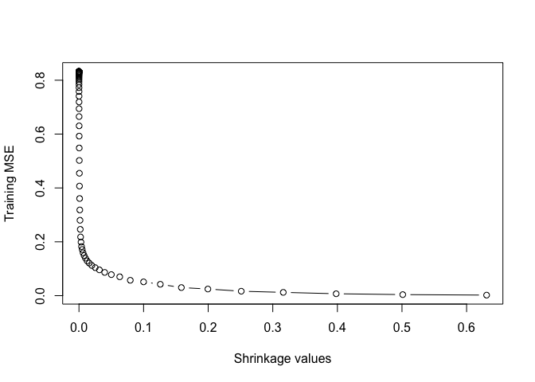<!-- -->

(boosting takes a bit longer time)

###d. on test


```r
set.seed(104)
test.err <- rep(NA, length(lambdas))
for (i in 1:length(lambdas)) {
    boost.hitters <- gbm(Salary ~ ., data = Hitters.train, distribution = "gaussian", n.trees = 1000, shrinkage = lambdas[i])
    yhat <- predict(boost.hitters, Hitters.test, n.trees = 1000)
    test.err[i] <- mean((yhat - Hitters.test$Salary)^2)
}
plot(lambdas, test.err, type = "b", xlab = "Shrinkage values", ylab = "Test MSE")
```

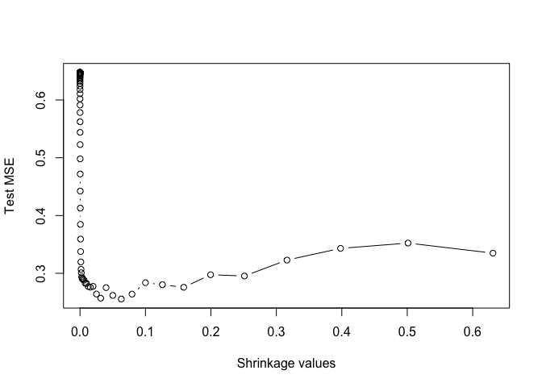<!-- -->


```r
min(test.err)
```

```
## [1] 0.2555452
```

```r
lambdas[which.min(test.err)]
```

```
## [1] 0.06309573
```

the minimum test error is 0.256, when lambda equals 0.063

###e. compare with ridge and lasso


```r
x <- model.matrix(Salary ~ ., data = Hitters.train)
x.test <- model.matrix(Salary ~ ., data = Hitters.test)
y <- Hitters.train$Salary
fit1 <- glmnet(x, y, alpha = 0)
pred1 <- predict(fit1, s = 0.01, newx = x.test)
mean((pred1 - Hitters.test$Salary)^2)
```

```
## [1] 0.4570283
```


```r
fit2 <- glmnet(x, y, alpha = 1)
pred2 <- predict(fit2, s = 0.01, newx = x.test)
mean((pred2 - Hitters.test$Salary)^2)
```

```
## [1] 0.4700537
```

ridge regression gives 0.457, while lasso gives 0.47. Both are bigger than that of boosting.

###f. importance


```r
boost.hitters <- gbm(Salary ~ ., data = Hitters.train, distribution = "gaussian", n.trees = 1000, shrinkage = lambdas[which.min(test.err)])
summary(boost.hitters)
```

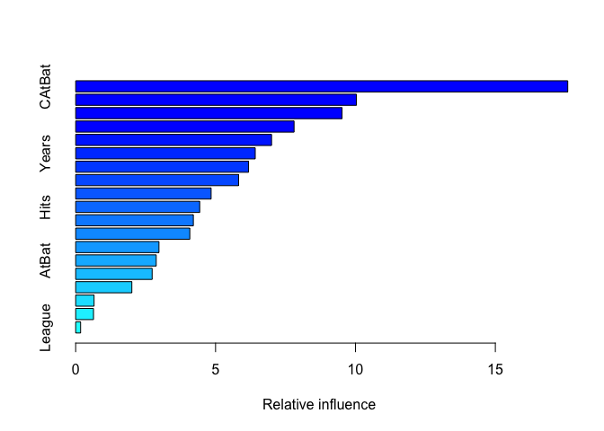<!-- -->

```
##                 var    rel.inf
## CAtBat       CAtBat 17.5884705
## CWalks       CWalks 10.0324056
## CRBI           CRBI  9.5208309
## CRuns         CRuns  7.8059015
## PutOuts     PutOuts  7.0016071
## Years         Years  6.4183891
## CHmRun       CHmRun  6.1794696
## Walks         Walks  5.8240695
## CHits         CHits  4.8411661
## Hits           Hits  4.4334018
## RBI             RBI  4.2060533
## Assists     Assists  4.0795868
## HmRun         HmRun  2.9768878
## AtBat         AtBat  2.8791267
## Errors       Errors  2.7330423
## Runs           Runs  2.0078048
## NewLeague NewLeague  0.6575910
## Division   Division  0.6373962
## League       League  0.1767993
```

CAtBat is the most important one.

###g. bagging


```r
set.seed(104)
bag.hitters <- randomForest(Salary ~ ., data = Hitters.train, mtry = 19, ntree = 500)
yhat.bag <- predict(bag.hitters, newdata = Hitters.test)
mean((yhat.bag - Hitters.test$Salary)^2)
```

```
## [1] 0.2311321
```

Bagging decreases the error.

##Q11

###a. splitting


```r
set.seed(105)
train <- 1:1000
Caravan$Purchase <- ifelse(Caravan$Purchase == "Yes", 1, 0)
Caravan.train <- Caravan[train, ]
Caravan.test <- Caravan[-train, ]
```

###b. boosting


```r
set.seed(105)
boost.caravan <- gbm(Purchase ~ ., data = Caravan.train, distribution = "gaussian", n.trees = 1000, shrinkage = 0.01)
```

```
## Warning in gbm.fit(x = x, y = y, offset = offset, distribution =
## distribution, : variable 50: PVRAAUT has no variation.
```

```
## Warning in gbm.fit(x = x, y = y, offset = offset, distribution =
## distribution, : variable 71: AVRAAUT has no variation.
```

```r
summary(boost.caravan)
```

<!-- -->

```
##               var     rel.inf
## PPERSAUT PPERSAUT 13.42951231
## MKOOPKLA MKOOPKLA  9.72053214
## MOPLHOOG MOPLHOOG  6.66218019
## MBERMIDD MBERMIDD  6.04523362
## PBRAND     PBRAND  5.51043861
## ABRAND     ABRAND  4.98711922
## MGODGE     MGODGE  4.15527443
## MINK3045 MINK3045  3.88074015
## MOSTYPE   MOSTYPE  3.00080626
## MAUT1       MAUT1  2.86217721
## PWAPART   PWAPART  2.66609711
## MAUT2       MAUT2  2.59866670
## MSKA         MSKA  2.07249046
## MBERARBG MBERARBG  1.85078046
## MINKGEM   MINKGEM  1.80381984
## MGODPR     MGODPR  1.69528261
## MSKB1       MSKB1  1.67094590
## MGODOV     MGODOV  1.59261758
## MSKC         MSKC  1.52379608
## PBYSTAND PBYSTAND  1.48638356
## MINK7512 MINK7512  1.45535041
## MHHUUR     MHHUUR  1.44664626
## MFWEKIND MFWEKIND  1.33747623
## MGODRK     MGODRK  1.27832717
## MAUT0       MAUT0  1.19576260
## MFGEKIND MFGEKIND  1.11721252
## MBERHOOG MBERHOOG  1.08977526
## MOPLMIDD MOPLMIDD  0.99431227
## MRELGE     MRELGE  0.97978187
## MOSHOOFD MOSHOOFD  0.85167950
## MINKM30   MINKM30  0.79640612
## MBERBOER MBERBOER  0.78314981
## MRELOV     MRELOV  0.64948315
## MINK4575 MINK4575  0.63740279
## MSKD         MSKD  0.57321193
## MZPART     MZPART  0.57187727
## MBERARBO MBERARBO  0.56610588
## MZFONDS   MZFONDS  0.55874272
## MSKB2       MSKB2  0.48548548
## MHKOOP     MHKOOP  0.47210377
## APERSAUT APERSAUT  0.44792194
## MFALLEEN MFALLEEN  0.44514274
## PMOTSCO   PMOTSCO  0.44174610
## MINK123M MINK123M  0.43128402
## MGEMOMV   MGEMOMV  0.41078929
## MGEMLEEF MGEMLEEF  0.25055356
## MOPLLAAG MOPLLAAG  0.22990733
## PLEVEN     PLEVEN  0.16299644
## MRELSA     MRELSA  0.07707697
## MAANTHUI MAANTHUI  0.04739418
## MBERZELF MBERZELF  0.00000000
## PWABEDR   PWABEDR  0.00000000
## PWALAND   PWALAND  0.00000000
## PBESAUT   PBESAUT  0.00000000
## PVRAAUT   PVRAAUT  0.00000000
## PAANHANG PAANHANG  0.00000000
## PTRACTOR PTRACTOR  0.00000000
## PWERKT     PWERKT  0.00000000
## PBROM       PBROM  0.00000000
## PPERSONG PPERSONG  0.00000000
## PGEZONG   PGEZONG  0.00000000
## PWAOREG   PWAOREG  0.00000000
## PZEILPL   PZEILPL  0.00000000
## PPLEZIER PPLEZIER  0.00000000
## PFIETS     PFIETS  0.00000000
## PINBOED   PINBOED  0.00000000
## AWAPART   AWAPART  0.00000000
## AWABEDR   AWABEDR  0.00000000
## AWALAND   AWALAND  0.00000000
## ABESAUT   ABESAUT  0.00000000
## AMOTSCO   AMOTSCO  0.00000000
## AVRAAUT   AVRAAUT  0.00000000
## AAANHANG AAANHANG  0.00000000
## ATRACTOR ATRACTOR  0.00000000
## AWERKT     AWERKT  0.00000000
## ABROM       ABROM  0.00000000
## ALEVEN     ALEVEN  0.00000000
## APERSONG APERSONG  0.00000000
## AGEZONG   AGEZONG  0.00000000
## AWAOREG   AWAOREG  0.00000000
## AZEILPL   AZEILPL  0.00000000
## APLEZIER APLEZIER  0.00000000
## AFIETS     AFIETS  0.00000000
## AINBOED   AINBOED  0.00000000
## ABYSTAND ABYSTAND  0.00000000
```


```r
head(summary(boost.caravan))
```

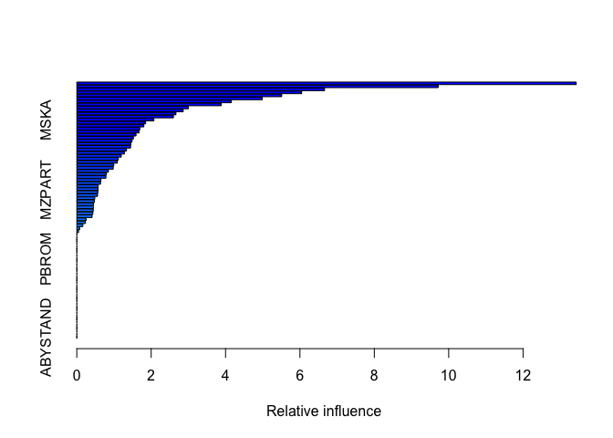<!-- -->

```
##               var   rel.inf
## PPERSAUT PPERSAUT 13.429512
## MKOOPKLA MKOOPKLA  9.720532
## MOPLHOOG MOPLHOOG  6.662180
## MBERMIDD MBERMIDD  6.045234
## PBRAND     PBRAND  5.510439
## ABRAND     ABRAND  4.987119
```

PRERSAUT is the most important one.

###c. prediction


```r
probs.test <- predict(boost.caravan, Caravan.test, n.trees = 1000, type = "response")
pred.test <- ifelse(probs.test > 0.2, 1, 0)
table(Caravan.test$Purchase, pred.test)
```

```
##    pred.test
##        0    1
##   0 4495   38
##   1  279   10
```


```r
10/(10+38)
```

```
## [1] 0.2083333
```

the fraction of people predicted to make a purchase that in fact make one is 0.208.


```r
logit.caravan <- glm(Purchase ~ ., data = Caravan.train, family = "binomial")
```

```
## Warning: glm.fit: fitted probabilities numerically 0 or 1 occurred
```

```r
probs.test2 <- predict(logit.caravan, Caravan.test, type = "response")
```

```
## Warning in predict.lm(object, newdata, se.fit, scale = 1, type = if (type
## == : prediction from a rank-deficient fit may be misleading
```

```r
pred.test2 <- ifelse(probs.test > 0.2, 1, 0)
table(Caravan.test$Purchase, pred.test2)
```

```
##    pred.test2
##        0    1
##   0 4495   38
##   1  279   10
```

which is the same compared to logistic.
