# Employee Retention Exploration
Here we're trying to find which factors determine the retention time of employees. Why? Because of all the efforts and money a company need to put in for finding a new employee. If we can find such determining factors, companies could formulate measures (such as raising the salary) in response.

## General info. about the dataset
First let's import the data

```r
Employee <- read_csv("GitHub/DS_CLASS_2019-20_Helen/Test/employee.csv")
```

```
## Parsed with column specification:
## cols(
##   employee_id = col_double(),
##   company_id = col_double(),
##   dept = col_character(),
##   seniority = col_double(),
##   salary = col_double(),
##   join_date = col_character(),
##   quit_date = col_character()
## )
```
It has variables: employee_id, company_id, dept, seniority, salary, join_date, quit_date

```r
names(Employee)
```

```
## [1] "employee_id" "company_id"  "dept"        "seniority"   "salary"     
## [6] "join_date"   "quit_date"
```
Change ids from continuous variables to factors

```r
employee1 <- mutate(Employee, Employee_id = as.factor(employee_id), Company_id = as.factor(company_id)) %>%
  select(dept:Company_id)
```

##Number of employees

Total number of employees in each company

```r
company <- group_by(employee1, Company_id) %>%
  count() %>%
  ungroup()
arrange(company, desc(n))
```

```
## # A tibble: 12 x 2
##    Company_id     n
##    <fct>      <int>
##  1 1           8486
##  2 2           4222
##  3 3           2749
##  4 4           2062
##  5 5           1755
##  6 6           1291
##  7 7           1224
##  8 8           1047
##  9 9            961
## 10 10           865
## 11 12            24
## 12 11            16
```

###The number of employees in each department in each company

```r
category <- group_by(employee1, Company_id, dept) %>%
  count() %>%
  ungroup()
arrange(category, desc(n))
```

```
## # A tibble: 70 x 3
##    Company_id dept                 n
##    <fct>      <chr>            <int>
##  1 1          customer_service  3157
##  2 1          engineer          1568
##  3 2          customer_service  1548
##  4 1          sales             1098
##  5 1          marketing         1085
##  6 1          data_science      1079
##  7 3          customer_service  1010
##  8 2          engineer           829
##  9 4          customer_service   777
## 10 5          customer_service   635
## # ... with 60 more rows
```


```r
ggplot(category) +
  geom_bar(stat = "identity", aes(x = Company_id, y = n, fill = dept), position = "fill")
```

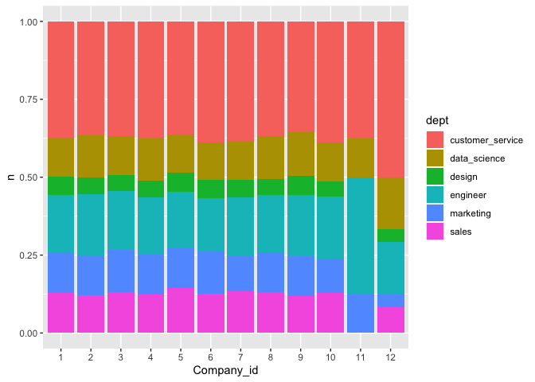<!-- -->

Some we can see that there are most people doing customer service in all companies, a lot but fewer people working in enigineering, and fewest people working on designing. Knowing this can help us to focus and weight on the requirement of department with most people.

##Factors that determine retention time

###General info about retention time

Since the quit dates of some employees are NA, we can either ignore those data when analyzing the length of the retention time or set them to some abitrary date when analyzing the factors that determine the length of retention. Here I choose to ignore those who didn't quit when considering the factors contribute to those quitting the job. I calculate the percentage of people didn't quit and try to explore its determining factors.

###Percentage of remaining employees


```r
retention_company <- 
  filter(employee1, is.na(quit_date)== T) %>% 
  group_by(Company_id) %>%
  count()
retention_company
```

```
## # A tibble: 12 x 2
## # Groups:   Company_id [12]
##    Company_id     n
##    <fct>      <int>
##  1 1           3865
##  2 2           2016
##  3 3           1218
##  4 4            909
##  5 5            772
##  6 6            579
##  7 7            532
##  8 8            468
##  9 9            432
## 10 10           385
## 11 11             4
## 12 12            12
```
The above code only gives us the number, but we want to find the percentage.

```r
company_percentage <- merge(company, retention_company, by = "Company_id", all = T) %>%
  mutate(company_percentage = n.y / n.x) %>%
  arrange(company_percentage)
company_percentage
```

```
##    Company_id  n.x  n.y company_percentage
## 1          11   16    4          0.2500000
## 2           7 1224  532          0.4346405
## 3           5 1755  772          0.4398860
## 4           4 2062  909          0.4408341
## 5           3 2749 1218          0.4430702
## 6          10  865  385          0.4450867
## 7           8 1047  468          0.4469914
## 8           6 1291  579          0.4484895
## 9           9  961  432          0.4495317
## 10          1 8486 3865          0.4554560
## 11          2 4222 2016          0.4774988
## 12         12   24   12          0.5000000
```
We can see that company 11 has the lowest retention rate, only around 25%, while others are abour 40-50%. Nevertheless, company 11 and 12 only have 20 and 36 employee records in total. If we ignore the, company 7 has the lowest while 2 has the highest. The range of their retention is 43% to 48%.

We can do the same thing for department:

```r
department <- group_by(employee1, dept) %>%
  count() %>%
  ungroup()
retention_department <- 
  filter(employee1, is.na(quit_date)== T) %>% 
  group_by(dept) %>%
  count()
dept_percentage <- merge(department, retention_department, by = "dept", all = T) %>%
  mutate(dept_percentage = n.y / n.x) %>%
  arrange(dept_percentage)
dept_percentage
```

```
##               dept  n.x  n.y dept_percentage
## 1            sales 3172 1361       0.4290668
## 2           design 1380  602       0.4362319
## 3        marketing 3167 1384       0.4370066
## 4 customer_service 9180 4086       0.4450980
## 5     data_science 3190 1508       0.4727273
## 6         engineer 4613 2251       0.4879688
```
Sales has the lowest retention rate, while enigeer has the highest. The range is 43% to 49%.

####Traits of those companies/departments with highest/lowest retention percentage

#####Company Mean Salary 
From my intuition, salary could be a important factor.

```r
company_salary <- group_by(employee1, Company_id) %>%
  select(salary) 
```

```
## Adding missing grouping variables: `Company_id`
```

```r
ggplot(company_salary) +
  geom_boxplot(aes(x = reorder(Company_id, salary, FUN =mean), y = salary))
```

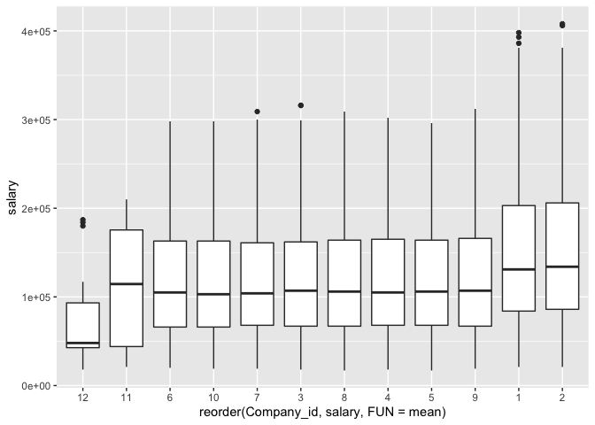<!-- -->
Compare this order with the order of company retention rate (from the lowest to the highest):

```r
company_mean_salary <- group_by(company_salary, Company_id) %>%
  summarize(mean = mean(salary))
company_mean_salary1 <- arrange(company_mean_salary, mean)
company_mean_salary1
```

```
## # A tibble: 12 x 2
##    Company_id    mean
##    <fct>        <dbl>
##  1 12          73000 
##  2 11         109562.
##  3 6          119926.
##  4 10         121554.
##  5 7          121583.
##  6 3          122119.
##  7 8          122285.
##  8 4          122721.
##  9 5          123349.
## 10 9          123905.
## 11 1          152168.
## 12 2          155728.
```

```r
retention_prep_salary <- data.frame(mean_salary = company_mean_salary1$Company_id, retention = company_percentage$Company_id)
retention_prep_salary
```

```
##    mean_salary retention
## 1           12        11
## 2           11         7
## 3            6         5
## 4           10         4
## 5            7         3
## 6            3        10
## 7            8         8
## 8            4         6
## 9            5         9
## 10           9         1
## 11           1         2
## 12           2        12
```

Company 12 have significantly lower average salary than the others, but it has the highest retention percentage. Overall, company mean salary cannot explain the retention. 

#####Department mean salary
Repeat about the same process from above.

```r
department_salary <- group_by(employee1, dept) %>%
  select(salary) 
```

```
## Adding missing grouping variables: `dept`
```

```r
ggplot(department_salary) +
  geom_boxplot(aes(x = reorder(dept, salary, FUN =mean), y = salary))
```

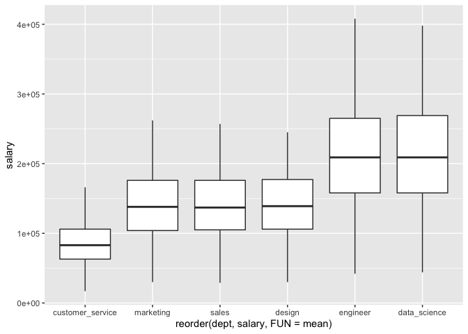<!-- -->


```r
dept_mean_salary <- group_by(department_salary, dept) %>%
  summarize(mean = mean(salary))
dept_mean_salary1 <- arrange(dept_mean_salary, mean)
dept_mean_salary1
```

```
## # A tibble: 6 x 2
##   dept                mean
##   <chr>              <dbl>
## 1 customer_service  82245.
## 2 marketing        135598.
## 3 sales            135912.
## 4 design           137461.
## 5 engineer         205545.
## 6 data_science     206886.
```

```r
retention_prep_dsalary <- data.frame(mean_salary = dept_mean_salary1$dept, retention = dept_percentage$dept)
retention_prep_dsalary
```

```
##        mean_salary        retention
## 1 customer_service            sales
## 2        marketing           design
## 3            sales        marketing
## 4           design customer_service
## 5         engineer     data_science
## 6     data_science         engineer
```
The correlation between them is also not so obvious. Though people work in data science and engineer received high salary and most people stay.

####Seniority

```r
senior <- group_by(employee1, seniority) %>%
  count() %>%
  ungroup()
retention_seniority <- 
  filter(employee1, is.na(quit_date)== T) %>% 
  group_by(seniority) %>%
  count()
senior_percentage <- merge(senior, retention_seniority, by = "seniority", all = T) %>%
  mutate(senior_percentage = n.y / n.x) %>%
  arrange(senior_percentage)
senior_percentage
```

```
##    seniority  n.x n.y senior_percentage
## 1          6  950 379         0.3989474
## 2         12  988 405         0.4099190
## 3         21  782 327         0.4181586
## 4          8 1008 422         0.4186508
## 5         16  936 402         0.4294872
## 6          5  936 403         0.4305556
## 7         10  927 404         0.4358145
## 8         25  715 312         0.4363636
## 9         13  894 394         0.4407159
## 10        20  844 375         0.4443128
## 11        15  911 406         0.4456641
## 12        11  924 412         0.4458874
## 13         9  944 422         0.4470339
## 14        14  920 412         0.4478261
## 15         7  928 417         0.4493534
## 16        23  785 355         0.4522293
## 17        28  585 265         0.4529915
## 18        19  910 413         0.4538462
## 19        24  743 345         0.4643338
## 20        17  893 415         0.4647256
## 21        27  642 300         0.4672897
## 22         2  942 442         0.4692144
## 23        22  764 359         0.4698953
## 24        18  872 415         0.4759174
## 25        26  694 335         0.4827089
## 26         3  881 434         0.4926220
## 27         1  861 431         0.5005807
## 28        29  626 318         0.5079872
## 29         4  895 473         0.5284916
## 30        98    1  NA                NA
## 31        99    1  NA                NA
```
There are one person who is 98 and one who is 99...Let's make a graph to see the trend.

```r
ggplot(senior_percentage) +
  geom_bar(stat = "identity", aes(x = seniority, y = senior_percentage))
```

```
## Warning: Removed 2 rows containing missing values (position_stack).
```

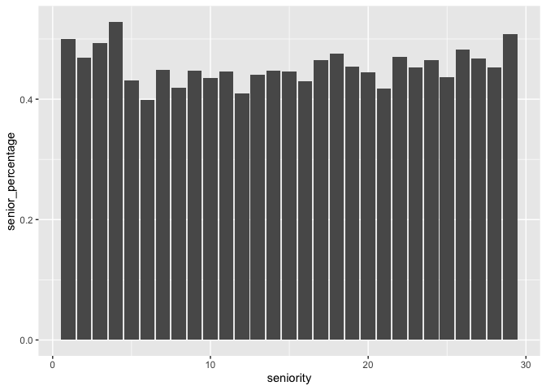<!-- -->
I guess there is no obvious relationship.

###Factors that determine the length of retention time
I calculate the retention time from the join and quit dates (only of those who quit the job). The retention is time intercal with unit of days.

```r
joindate <- as.Date(as.character(employee1$join_date), "%m/%d/%y")
quitdate <- as.Date(as.character(employee1$quit_date), "%m/%d/%y")
employee2 <- mutate(employee1, retention = as.numeric(difftime(quitdate, joindate), unit = "days")) %>%
  filter(is.na(retention) == F) %>%
  arrange(retention)
employee2
```

```
## # A tibble: 13,510 x 8
##    dept  seniority salary join_date quit_date Employee_id Company_id
##    <chr>     <dbl>  <dbl> <chr>     <chr>     <fct>       <fct>     
##  1 cust~         3  23000 10/8/12   1/18/13   158442      9         
##  2 mark~        25 211000 10/1/12   1/28/13   564823      1         
##  3 engi~         6 212000 9/16/13   1/28/14   551249      1         
##  4 cust~         9  78000 9/15/14   1/28/15   946036      7         
##  5 cust~        28  95000 9/4/12    1/18/13   42759       8         
##  6 cust~        18 127000 8/3/11    1/3/12    212530      1         
##  7 sales        29 152000 8/13/12   1/15/13   154790      6         
##  8 data~        12 168000 8/6/12    1/14/13   765161      10        
##  9 sales         8  88000 8/22/11   1/30/12   589855      7         
## 10 desi~         5 131000 8/15/11   1/30/12   888499      1         
## # ... with 13,500 more rows, and 1 more variable: retention <dbl>
```

To get a quick idea of the retention time in general:

```r
summary(select(employee2, retention))
```

```
##    retention     
##  Min.   : 102.0  
##  1st Qu.: 361.0  
##  Median : 417.0  
##  Mean   : 613.5  
##  3rd Qu.: 781.0  
##  Max.   :1726.0
```


```r
ggplot(employee2) +
  geom_histogram(aes(x = retention), binwidth = 20)
```

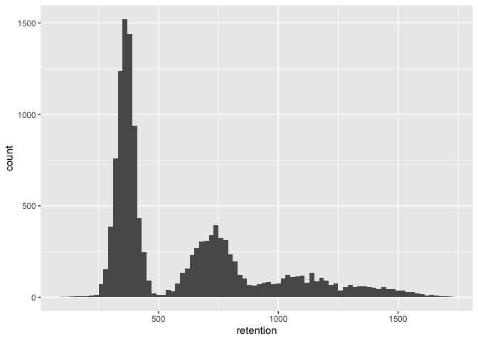<!-- -->
For some reasons there are three humps. 
Let's see if they are caused by specific factors.

####Company
Because the first bump is much higher than the other two, so I break the graph into to two parts. 

```r
ggplot(employee2) +
  geom_bar(aes(x = retention, fill = Company_id), postion = "fill") +
  coord_cartesian(xlim = c(0, 500))
```

```
## Warning: Ignoring unknown parameters: postion
```

```
## Warning: position_stack requires non-overlapping x intervals
```

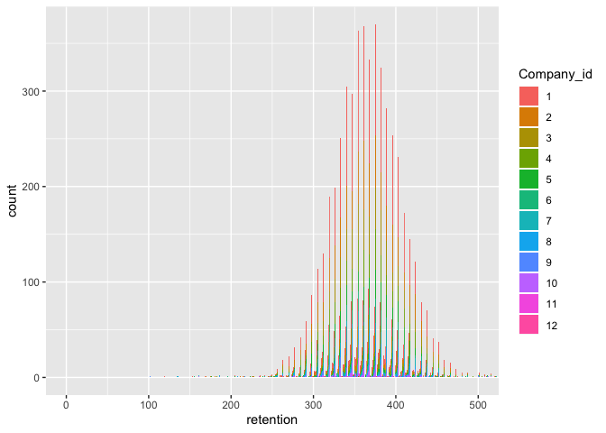<!-- -->


```r
ggplot(employee2) +
  geom_bar(aes(x = retention, fill = Company_id), postion = "fill") +
  coord_cartesian(xlim = c(500, 1700), ylim = c(0, 100))
```

```
## Warning: Ignoring unknown parameters: postion
```

```
## Warning: position_stack requires non-overlapping x intervals
```

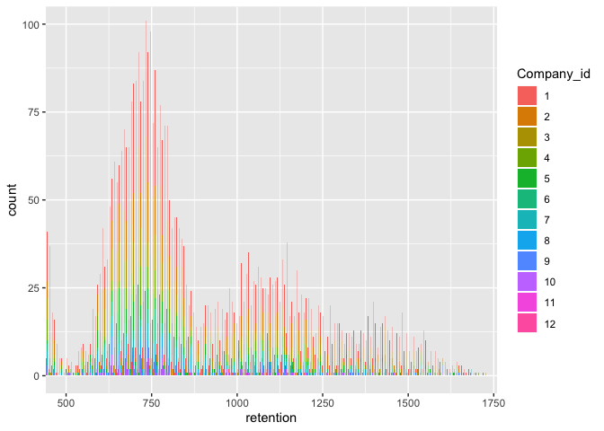<!-- -->

####Department

```r
ggplot(employee2) +
  geom_bar(aes(x = retention, fill = dept), postion = "fill") +
  coord_cartesian(xlim = c(0, 500))
```

```
## Warning: Ignoring unknown parameters: postion
```

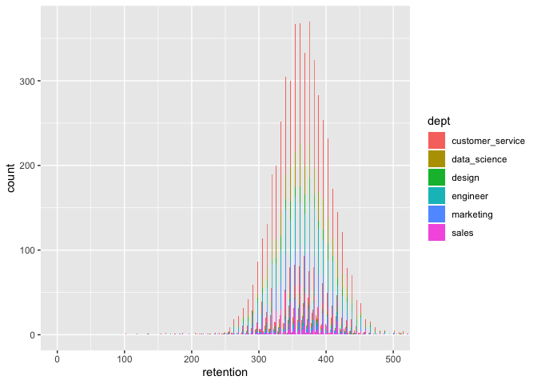<!-- -->


```r
ggplot(employee2) +
  geom_bar(aes(x = retention, fill = dept), postion = "fill") +
  coord_cartesian(xlim = c(500, 1700), ylim = c(0, 100))
```

```
## Warning: Ignoring unknown parameters: postion
```

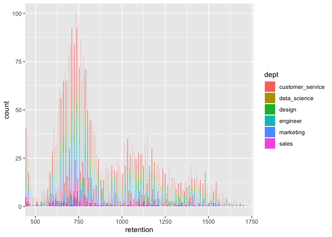<!-- -->

####Seniority

```r
ggplot(employee2) +
  geom_point(aes(x = seniority, y = retention)) 
```

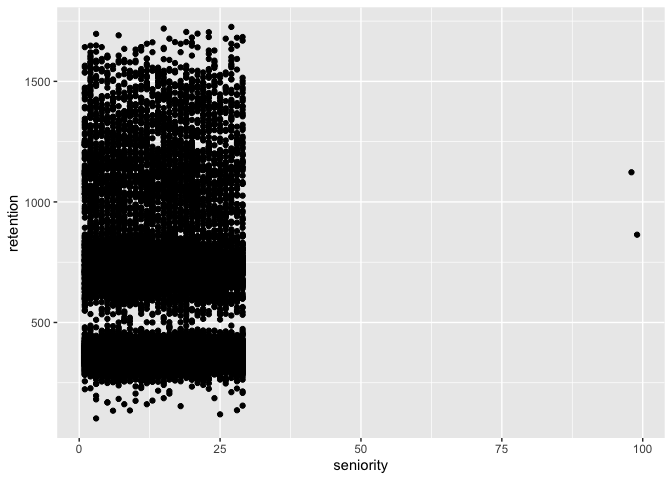<!-- -->
let's trim the two outliers

```r
employee3 <- filter(employee2, seniority < 50)
```


```r
ggplot(employee3) +
  geom_point(aes(x = seniority, y = retention), alpha = 1/30) 
```

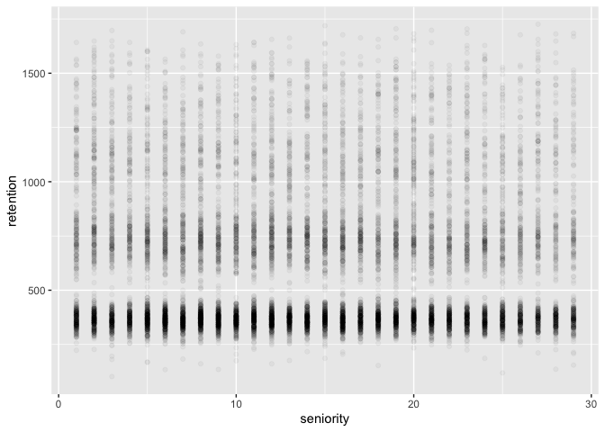<!-- -->
