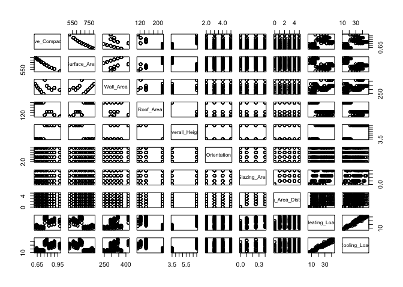

## Dataset info

This dataset contains data that describes 768 households using 10 variables, including area, orientation, height, and energy efficiency. The dataset can be found here: http://archive.ics.uci.edu/ml/datasets/Energy+efficiency# along with the description. Here we want to use other variables to predict the heating load, the quantity of heat per unit time that must be supplied to maintain the temperature in a building, by finding a regression model. 


```r
data <- read_xlsx("ENB2012_data.xlsx") %>%
  na.omit()
glimpse(data)
```

```
## Observations: 768
## Variables: 10
## $ X1 <dbl> 0.98, 0.98, 0.98, 0.98, 0.90, 0.90, 0.90, 0.90, 0.86, 0.86,...
## $ X2 <dbl> 514.5, 514.5, 514.5, 514.5, 563.5, 563.5, 563.5, 563.5, 588...
## $ X3 <dbl> 294.0, 294.0, 294.0, 294.0, 318.5, 318.5, 318.5, 318.5, 294...
## $ X4 <dbl> 110.25, 110.25, 110.25, 110.25, 122.50, 122.50, 122.50, 122...
## $ X5 <dbl> 7.0, 7.0, 7.0, 7.0, 7.0, 7.0, 7.0, 7.0, 7.0, 7.0, 7.0, 7.0,...
## $ X6 <dbl> 2, 3, 4, 5, 2, 3, 4, 5, 2, 3, 4, 5, 2, 3, 4, 5, 2, 3, 4, 5,...
## $ X7 <dbl> 0, 0, 0, 0, 0, 0, 0, 0, 0, 0, 0, 0, 0, 0, 0, 0, 0, 0, 0, 0,...
## $ X8 <dbl> 0, 0, 0, 0, 0, 0, 0, 0, 0, 0, 0, 0, 0, 0, 0, 0, 0, 0, 0, 0,...
## $ Y1 <dbl> 15.55, 15.55, 15.55, 15.55, 20.84, 21.46, 20.71, 19.68, 19....
## $ Y2 <dbl> 21.33, 21.33, 21.33, 21.33, 28.28, 25.38, 25.16, 29.60, 27....
```

Firstly I rename the variables according to the description online


```r
data <- data %>%
  rename(
    Relative_Compactness = X1,
    Surface_Area = X2,
    Wall_Area = X3,
    Roof_Area = X4,
    Overall_Height = X5,
    Orientation = X6,
    Glazing_Area = X7,
    Glazing_Area_Distribution = X8,
    Heating_Load = Y1,
    Cooling_Load = Y2
  )
```

###Exploration


```r
pairs(data)
```

<!-- -->

From the plots, we can see that relative compactness and surface area are somewhat correlated, while heating load and cooling load are highly correalted. 
Meanwhile, although all the data are numerical, it appears for most of the variables (roof area, height, orientation, glazing area, glazing area distribution) have only limited values. 
We will first see if considering this near-zero variance in pre-processing process is able to generate good regression fit. If not we can create dummy variables.

##Regression model for heating load

###Pre-processing
 
It appears at first sight all variables are numerical. Let's try nzv first

####near zero variance


```r
nzv <- nearZeroVar(data, saveMetrics= TRUE)
nzv
```

```
##                           freqRatio percentUnique zeroVar   nzv
## Relative_Compactness            1.0     1.5625000   FALSE FALSE
## Surface_Area                    1.0     1.5625000   FALSE FALSE
## Wall_Area                       1.0     0.9114583   FALSE FALSE
## Roof_Area                       2.0     0.5208333   FALSE FALSE
## Overall_Height                  1.0     0.2604167   FALSE FALSE
## Orientation                     1.0     0.5208333   FALSE FALSE
## Glazing_Area                    1.0     0.5208333   FALSE FALSE
## Glazing_Area_Distribution       1.0     0.7812500   FALSE FALSE
## Heating_Load                    1.2    76.4322917   FALSE FALSE
## Cooling_Load                    1.0    82.8125000   FALSE FALSE
```

There aren't any, interestingly.

####dummy variables


####correlated predictors

According to our observation there are.


```r
correlation <- cor(data)
summary(correlation[upper.tri(correlation)])
```

```
##     Min.  1st Qu.   Median     Mean  3rd Qu.     Max. 
## -0.99190  0.00000  0.00000  0.01516  0.21296  0.97586
```

yes there are.


```r
high_cor <- findCorrelation(correlation, cutoff = .75)
data1 <- data[,-high_cor]
cor1 <- cor(data1)
summary(cor1[upper.tri(cor1)])
```

```
##       Min.    1st Qu.     Median       Mean    3rd Qu.       Max. 
## -0.2037817  0.0000000  0.0000000  0.0009183  0.0000000  0.2129642
```


```r
data1
```

```
## # A tibble: 768 x 5
##    Relative_Compactn~ Wall_Area Orientation Glazing_Area Glazing_Area_Dist~
##                 <dbl>     <dbl>       <dbl>        <dbl>              <dbl>
##  1               0.98      294            2            0                  0
##  2               0.98      294            3            0                  0
##  3               0.98      294            4            0                  0
##  4               0.98      294            5            0                  0
##  5               0.9       318.           2            0                  0
##  6               0.9       318.           3            0                  0
##  7               0.9       318.           4            0                  0
##  8               0.9       318.           5            0                  0
##  9               0.86      294            2            0                  0
## 10               0.86      294            3            0                  0
## # ... with 758 more rows
```

It removes surface area, roof area, overall height, and heating and cooling load. But since heating load is what we want to predict I will manually add that one back. (This also indicates that heating load might be highly correlated to few/one of the predictor.)


```r
heating = data$Heating_Load
data2 <- cbind(data1, heating)
```

###Spliting into train and test

Here we randomly sampled 2/3 of all data to put into the training set, and the rest into the test set.


```r
set.seed(15)
in_train <- sample(dim(data2)[1], dim(data2)[1] *2 /3)
train <- data2[in_train, ]
test <- data2[-in_train, ]
```

And normalize it..


```r
provalue <- preProcess(train, method = c("center", "scale"))
protrain <- predict(provalue, train)
protest <- predict(provalue, test)
```

###Fitting linear model


```r
fit_control <- trainControl(method = "repeatedcv",
                           number = 10,
                           repeats = 10,
                           classProbs = TRUE)
```


```r
fit_lm <- lm(heating ~ ., data = protrain)
summary(fit_lm)
```

```
## 
## Call:
## lm(formula = heating ~ ., data = protrain)
## 
## Residuals:
##      Min       1Q   Median       3Q      Max 
## -1.29271 -0.23901 -0.02296  0.12466  1.20356 
## 
## Coefficients:
##                            Estimate Std. Error t value Pr(>|t|)    
## (Intercept)               1.886e-16  1.910e-02   0.000    1.000    
## Relative_Compactness      7.180e-01  1.942e-02  36.977   <2e-16 ***
## Wall_Area                 6.144e-01  1.943e-02  31.625   <2e-16 ***
## Orientation               1.522e-02  1.913e-02   0.796    0.427    
## Glazing_Area              2.826e-01  1.958e-02  14.433   <2e-16 ***
## Glazing_Area_Distribution 1.755e-02  1.957e-02   0.897    0.370    
## ---
## Signif. codes:  0 '***' 0.001 '**' 0.01 '*' 0.05 '.' 0.1 ' ' 1
## 
## Residual standard error: 0.4322 on 506 degrees of freedom
## Multiple R-squared:  0.815,	Adjusted R-squared:  0.8132 
## F-statistic: 445.8 on 5 and 506 DF,  p-value: < 2.2e-16
```

Adjusted R-squared value is okay. And from the p-values, relative compactness, wall-area, and glazing area seemed to be significantly correlated to heating load, 
which seems to make sense since wall area and percentage of window area are intuitively related to heat dispersion.
According to google, relative compactness seems to evaluate the layout of a house. It seems to be the most influential predictor. 

####Linear model w/o scaling data


```r
Fit_lm <- lm(heating ~ Relative_Compactness + Wall_Area + Glazing_Area, data = train)
summary(Fit_lm)
```

```
## 
## Call:
## lm(formula = heating ~ Relative_Compactness + Wall_Area + Glazing_Area, 
##     data = train)
## 
## Residuals:
##      Min       1Q   Median       3Q      Max 
## -13.5025  -2.5211  -0.1423   1.0845  12.2559 
## 
## Coefficients:
##                       Estimate Std. Error t value Pr(>|t|)    
## (Intercept)          -81.90858    2.25512  -36.32   <2e-16 ***
## Relative_Compactness  70.38915    1.90293   36.99   <2e-16 ***
## Wall_Area              0.14279    0.00451   31.66   <2e-16 ***
## Glazing_Area          21.68928    1.44974   14.96   <2e-16 ***
## ---
## Signif. codes:  0 '***' 0.001 '**' 0.01 '*' 0.05 '.' 0.1 ' ' 1
## 
## Residual standard error: 4.403 on 508 degrees of freedom
## Multiple R-squared:  0.8145,	Adjusted R-squared:  0.8134 
## F-statistic: 743.4 on 3 and 508 DF,  p-value: < 2.2e-16
```

Try this model with three predictors in the train set without scaling, it shows that 1 unit increase in relative compactness, wall area, and glazing area will result in 70.39, 0.143, and 21.670 units of increase in the heating load.

####w/ cross-validation

(The following includes cross validation.)


```r
set.seed(825)
fit_lm1 <- train(heating ~ Relative_Compactness + Wall_Area + Glazing_Area, 
                method = "lm",
                data = protrain, 
                trControl = fit_control)
```

```
## Warning in train.default(x, y, weights = w, ...): cannnot compute class
## probabilities for regression
```

```r
fit_lm1
```

```
## Linear Regression 
## 
## 512 samples
##   3 predictor
## 
## No pre-processing
## Resampling: Cross-Validated (10 fold, repeated 10 times) 
## Summary of sample sizes: 461, 461, 461, 461, 461, 460, ... 
## Resampling results:
## 
##   RMSE       Rsquared  MAE      
##   0.4313194  0.818075  0.2982948
## 
## Tuning parameter 'intercept' was held constant at a value of TRUE
```

####Testing


```r
pred1 <- predict(fit_lm1, protest)
rmse1 <- sqrt(mean((protest$heating - pred1)^2))
rmse1
```

```
## [1] 0.4216099
```

```r
rmse1*sd(train$heating)
```

```
## [1] 4.296839
```

the error is 4.297 units of the heating load.

###Linear regression w/ feature engineered

Here I will introduce new features to be used to predict the heating load: volume of the house (surface area*overall height) and exposed area (roof area+wall area)


```r
data3 <- data %>%
  mutate(Volume = Surface_Area*Overall_Height, Exposed_Area = Roof_Area + Wall_Area)
```


```r
correlation1 <- cor(data)
summary(correlation[upper.tri(correlation1)])
```

```
##     Min.  1st Qu.   Median     Mean  3rd Qu.     Max. 
## -0.99190  0.00000  0.00000  0.01516  0.21296  0.97586
```


```r
high_cor1 <- findCorrelation(correlation1, cutoff = .75)
data4 <- data3[,-high_cor1]
cor2 <- cor(data4)
summary(cor1[upper.tri(cor2)])
```

```
##    Min. 1st Qu.  Median    Mean 3rd Qu.    Max.    NA's 
## 0.00000 0.00000 0.00000 0.03549 0.00000 0.21296      15
```


```r
data4 
```

```
## # A tibble: 768 x 7
##    Relative_Compac~ Wall_Area Orientation Glazing_Area Glazing_Area_Di~
##               <dbl>     <dbl>       <dbl>        <dbl>            <dbl>
##  1             0.98      294            2            0                0
##  2             0.98      294            3            0                0
##  3             0.98      294            4            0                0
##  4             0.98      294            5            0                0
##  5             0.9       318.           2            0                0
##  6             0.9       318.           3            0                0
##  7             0.9       318.           4            0                0
##  8             0.9       318.           5            0                0
##  9             0.86      294            2            0                0
## 10             0.86      294            3            0                0
## # ... with 758 more rows, and 2 more variables: Volume <dbl>,
## #   Exposed_Area <dbl>
```


```r
data4 <- cbind(data4, heating)
```


```r
set.seed(16)
in_train1 <- sample(dim(data4)[1], dim(data4)[1] *2 /3)
train1 <- data4[in_train1, ]
test1 <- data4[-in_train1, ]

provalue1 <- preProcess(train1, method = c("center", "scale"))
protrain1 <- predict(provalue1, train1)
protest1 <- predict(provalue1, test1)
```


```r
fit_lm2 <- lm(heating ~ ., data = protrain1)
summary(fit_lm2)
```

```
## 
## Call:
## lm(formula = heating ~ ., data = protrain1)
## 
## Residuals:
##      Min       1Q   Median       3Q      Max 
## -0.88005 -0.12622 -0.00533  0.13926  0.75774 
## 
## Coefficients:
##                             Estimate Std. Error t value Pr(>|t|)    
## (Intercept)                2.101e-16  1.284e-02   0.000   1.0000    
## Relative_Compactness      -5.113e-02  1.600e-01  -0.320   0.7494    
## Wall_Area                  3.477e-01  1.355e-01   2.565   0.0106 *  
## Orientation                1.041e-02  1.289e-02   0.808   0.4197    
## Glazing_Area               2.626e-01  1.320e-02  19.901   <2e-16 ***
## Glazing_Area_Distribution  3.289e-02  1.315e-02   2.500   0.0127 *  
## Volume                     6.544e-01  5.677e-02  11.528   <2e-16 ***
## Exposed_Area              -3.860e-01  2.360e-01  -1.636   0.1025    
## ---
## Signif. codes:  0 '***' 0.001 '**' 0.01 '*' 0.05 '.' 0.1 ' ' 1
## 
## Residual standard error: 0.2904 on 504 degrees of freedom
## Multiple R-squared:  0.9168,	Adjusted R-squared:  0.9156 
## F-statistic: 793.4 on 7 and 504 DF,  p-value: < 2.2e-16
```

We can see that volume appears to be the most influential indicator, as well as glazing area. 
Wall area appears to be somewhat significant whereas exposed area is not at all. So wall area matters more than roof area.

##Classification

As noticed in the previous sections (exploration), that x3-x8 only have a few values, so we can try classfication methods. 
According to caret, tree-type model works with those variables.

Starting again with original data


```r
data
```

```
## # A tibble: 768 x 10
##    Relative_Compac~ Surface_Area Wall_Area Roof_Area Overall_Height
##               <dbl>        <dbl>     <dbl>     <dbl>          <dbl>
##  1             0.98         514.      294       110.              7
##  2             0.98         514.      294       110.              7
##  3             0.98         514.      294       110.              7
##  4             0.98         514.      294       110.              7
##  5             0.9          564.      318.      122.              7
##  6             0.9          564.      318.      122.              7
##  7             0.9          564.      318.      122.              7
##  8             0.9          564.      318.      122.              7
##  9             0.86         588       294       147               7
## 10             0.86         588       294       147               7
## # ... with 758 more rows, and 5 more variables: Orientation <dbl>,
## #   Glazing_Area <dbl>, Glazing_Area_Distribution <dbl>,
## #   Heating_Load <dbl>, Cooling_Load <dbl>
```

From both visualization and correlation sections it appears that cooling load highly correlates with heating load (and they seem to evaluate very similar process) so I'm still going to remove this variable while keeping the others.


```r
Data <- select(data, -Cooling_Load)
```

preprocessing...


```r
set.seed(17)
in_Train <- sample(dim(Data)[1], dim(Data)[1] *2 /3)
Train <- Data[in_Train, ]
Test <- Data[-in_Train, ]

proValue <- preProcess(Train, method = c("center", "scale"))
proTrain <- predict(proValue, Train)
proTest <- predict(proValue, Test)
```


```r
length(Data$Relative_Compactness)
```

```
## [1] 768
```

```r
length(Data$Surface_Area)
```

```
## [1] 768
```


```r
gbmGrid <-  expand.grid(interaction.depth = c(1, 5, 9), 
                        n.trees = (1:30)*50, 
                        shrinkage = 0.1,
                        n.minobsinnode = 20)
                        
nrow(gbmGrid)
```

```
## [1] 90
```

```r
fitControl <- trainControl(method = "gbm")
```


```r
glimpse(Data)
```

```
## Observations: 768
## Variables: 9
## $ Relative_Compactness      <dbl> 0.98, 0.98, 0.98, 0.98, 0.90, 0.90, ...
## $ Surface_Area              <dbl> 514.5, 514.5, 514.5, 514.5, 563.5, 5...
## $ Wall_Area                 <dbl> 294.0, 294.0, 294.0, 294.0, 318.5, 3...
## $ Roof_Area                 <dbl> 110.25, 110.25, 110.25, 110.25, 122....
## $ Overall_Height            <dbl> 7.0, 7.0, 7.0, 7.0, 7.0, 7.0, 7.0, 7...
## $ Orientation               <dbl> 2, 3, 4, 5, 2, 3, 4, 5, 2, 3, 4, 5, ...
## $ Glazing_Area              <dbl> 0, 0, 0, 0, 0, 0, 0, 0, 0, 0, 0, 0, ...
## $ Glazing_Area_Distribution <dbl> 0, 0, 0, 0, 0, 0, 0, 0, 0, 0, 0, 0, ...
## $ Heating_Load              <dbl> 15.55, 15.55, 15.55, 15.55, 20.84, 2...
```


```r
set.seed(825)
proTrain1<-select(proTrain, -Relative_Compactness, -Surface_Area)
# gbmFit2 <- train(heating ~ . , data = proTrain1, 
#                  method = "gbm", 
#                  tuneGrid = gbmGrid,
#                  trControl = fitControl, 
#                  na.action = na.omit)
#  Error in model.frame.default(form = heating ~ ., data = proTrain1, na.action = na.omit) : 
#  variable lengths differ (found for 'Wall_Area')
```


set.seed(122)
gbm.fit <- gbm(
  formula = heating ~ .,
  distribution = gaussian,
  data = proTrain,
  n.trees = 10000,
  interaction.depth = 1,
  shrinkage = 0.001,
  cv.folds = 5,
  verbose = FALSE
  )  


set.seed(849)
RF <- train(heating ~ ., data = proTrain, 
                            method = "ordinalRF", 
                            trControl = fitControl,  
                            metric = "Kappa" 
                            )


