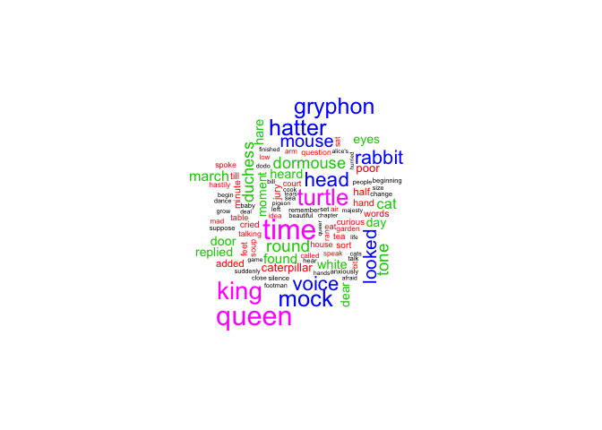
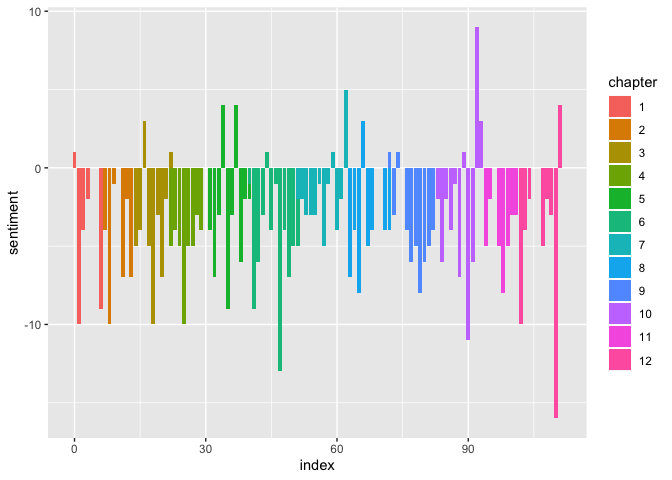
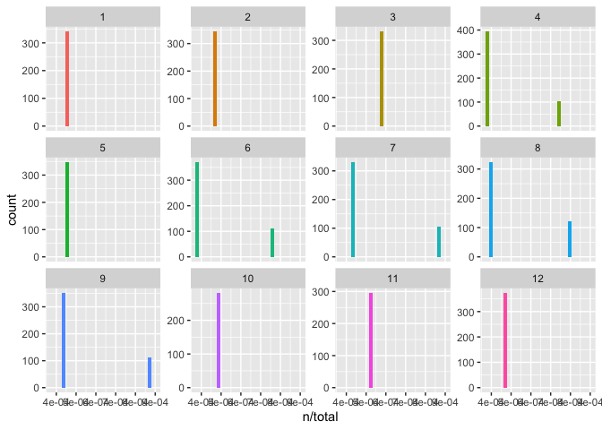
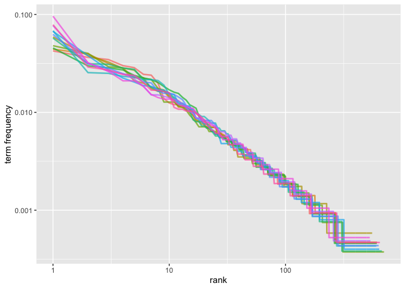
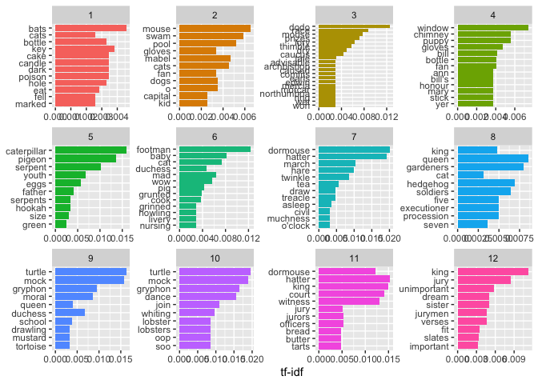
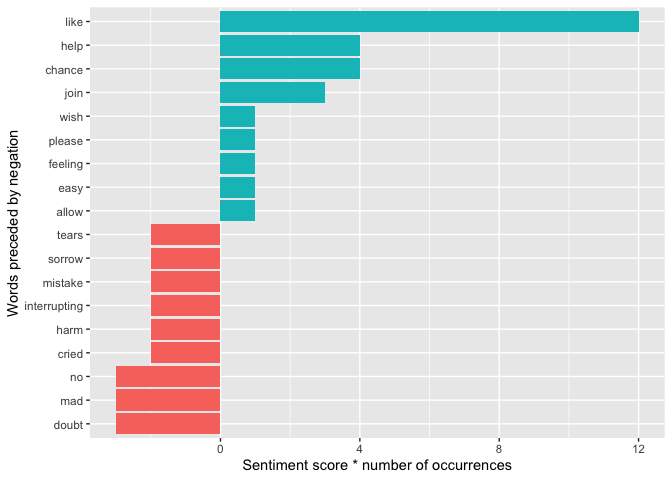
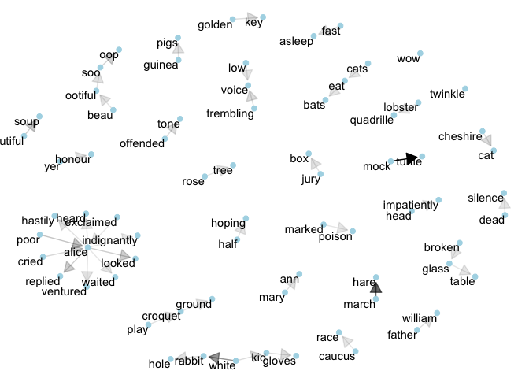
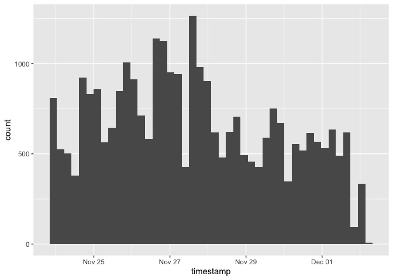
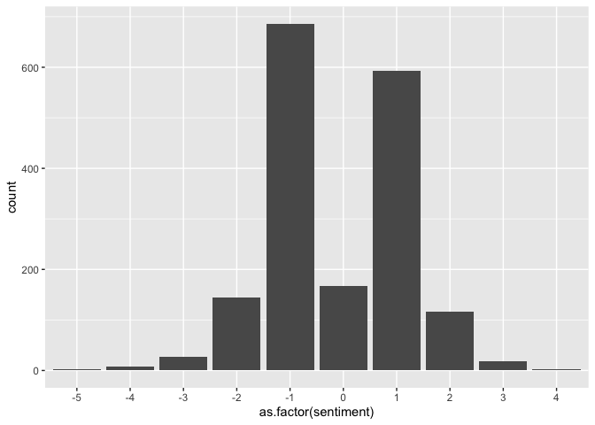
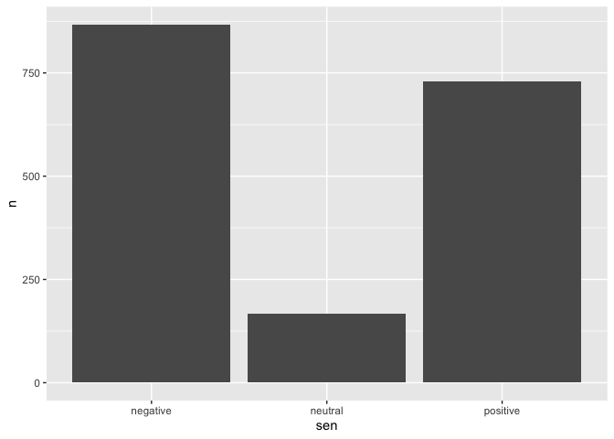

##Overview

Alice's Advantures in Wonderland, also often known as ALice in Wonderland, is one of the most popular English novel wrriting by Lewis Carroll in 1865. Its narrative, characters, and imagery have hugely influenced later literature and pop culture. In this project, I will try to identify common sentiments, motifs, word frequency, as well as in what ways this book is refered to on Twitter using R. 

##Import&Tidy

The book is found on gutenberg.org.


```r
alice <- gutenberg_download(c(11))
```

```
## Determining mirror for Project Gutenberg from http://www.gutenberg.org/robot/harvest
```

```
## Using mirror http://aleph.gutenberg.org
```

The text is unnested into words, dropping the punctuations and extremely common words such as "the." The chapter and line number are kept for later reference.


```r
alice_tidy <- alice %>%
  mutate(linenumber = row_number(), chapter = cumsum(str_detect(text, regex("^chapter [\\divxlc]", ignore_case = T)))) %>%
  unnest_tokens(word, text) %>%
  anti_join(stop_words)
```

```
## Joining, by = "word"
```

```r
alice_tidy
```

```
## # A tibble: 7,619 x 4
##    gutenberg_id linenumber chapter word      
##           <int>      <int>   <int> <chr>     
##  1           11          1       0 alice's   
##  2           11          1       0 adventures
##  3           11          1       0 wonderland
##  4           11          3       0 lewis     
##  5           11          3       0 carroll   
##  6           11          5       0 millennium
##  7           11          5       0 fulcrum   
##  8           11          5       0 edition   
##  9           11          5       0 3.0       
## 10           11         10       1 chapter   
## # ... with 7,609 more rows
```

##Word frequencies


```r
alice_count <- alice_tidy %>%
  count(word, sort = T) 
filter(alice_count, n > 45)
```

```
## # A tibble: 11 x 2
##    word        n
##    <chr>   <int>
##  1 alice     386
##  2 time       71
##  3 queen      68
##  4 king       61
##  5 turtle     57
##  6 mock       56
##  7 gryphon    55
##  8 hatter     55
##  9 head       49
## 10 voice      48
## 11 rabbit     47
```

The most common word is unsurprisingly "Alice," which appears more than 300 times than other most frequent words such as "time", "queen", etc. Interestingly, most of these words are characters: alice, queen, king, turtle, gryphon, hatter, and rabbit. The only verb among these words are "mock," which demonstrates the tone of this book.
However, the count of the plural form of the words are not added to the count of the singular form.

###Wordcloud

A wordcloud without Alice is generated.

```r
alice_tidy %>%
  count(word) %>%
  filter(word != "alice") %>%
  with(wordcloud(word, n, max.words = 100, scale=c(2, 0.1), colors= c(1:4, 6)))
```

<!-- -->


##Sentiment

###Sentiment overview

I analyze the most common type of sentiment occur in the entire book using NCR lexicon which maps a word with one of the eight types of sentiment.


```r
sentiment <- alice_tidy %>%
  inner_join(get_sentiments("nrc")) %>%
  count(sentiment, sort = T) 
```

```
## Joining, by = "word"
```

```r
sentiment
```

```
## # A tibble: 10 x 2
##    sentiment        n
##    <chr>        <int>
##  1 positive       887
##  2 negative       659
##  3 anticipation   448
##  4 trust          420
##  5 fear           366
##  6 joy            345
##  7 sadness        329
##  8 anger          317
##  9 surprise       221
## 10 disgust        189
```
We can see that overall there is more words with positive sentiments. Note that fear ranked quite high here.

###Sentiment trajectory

Here I use the Bing lexicon to generate a sentiment score for each chapter. I count the number of words with positive and negative connotation and subtract the number of negative words from the number of positive words.


```r
alice_sentiment <- alice_tidy %>%
  inner_join(get_sentiments("bing")) %>%
  count(chapter, sentiment) %>%
  spread(sentiment, n, fill = 0) %>%
  mutate(sentiment = positive - negative, chapter = as.factor(chapter))
```

```
## Joining, by = "word"
```

```r
alice_sentiment
```

```
## # A tibble: 12 x 4
##    chapter negative positive sentiment
##    <fct>      <dbl>    <dbl>     <dbl>
##  1 1             56       32       -24
##  2 2             58       27       -31
##  3 3             55       23       -32
##  4 4             61       20       -41
##  5 5             53       26       -27
##  6 6             85       30       -55
##  7 7             47       27       -20
##  8 8             63       30       -33
##  9 9             77       38       -39
## 10 10            63       37       -26
## 11 11            53       22       -31
## 12 12            64       26       -38
```


```r
ggplot(alice_sentiment) +
  geom_col(aes(chapter, sentiment))
```

<!-- -->

Interesting enough, all chapters have more negative words than positive words. If we break down the chapter into smaller sections of 30 lines:


```r
alice_sentiment1 <- alice_tidy %>%
  inner_join(get_sentiments("bing")) %>%
  group_by(chapter) %>%
  count(index = linenumber %/% 30, sentiment) %>%
  spread(sentiment, n, fill = 0) %>%
  ungroup() %>%
  mutate(sentiment = positive - negative, chapter = as.factor(chapter)) 
```

```
## Joining, by = "word"
```

```r
alice_sentiment1
```

```
## # A tibble: 118 x 5
##    chapter index negative positive sentiment
##    <fct>   <dbl>    <dbl>    <dbl>     <dbl>
##  1 1           0        3        4         1
##  2 1           1       13        3       -10
##  3 1           2        8        4        -4
##  4 1           3        5        3        -2
##  5 1           4        9        9         0
##  6 1           5        5        5         0
##  7 1           6       13        4        -9
##  8 2           7        4        0        -4
##  9 2           8       14        4       -10
## 10 2           9        4        3        -1
## # ... with 108 more rows
```

```r
alice_sentiment1 %>% 
  ggplot() +
  geom_col(aes(index, sentiment, fill = chapter), show.legend = T)
```

<!-- -->

It's still mostly negative, despite in ~60 lines in chapter 11.

##tf-idf

tf-idf is a measure that can be used to analyze how important a word is to a document in a collection of documents.

###Term frequency

First I'll look at the term frequency (tf) of each chapter of this book. 

```r
alice_chapter <- alice %>%
  mutate(linenumber = row_number(), chapter = cumsum(str_detect(text, regex("^chapter [\\divxlc]", ignore_case = T)))) %>%
  unnest_tokens(word, text) %>% 
  count(chapter, word, sort = TRUE) %>% 
  ungroup()
alice_chapter_total <- alice_chapter %>%
  group_by(chapter) %>%
  summarize(total = sum(n))
```


```r
alice_chapter <- left_join(alice_chapter, alice_chapter_total) %>%
  filter(chapter != 0) %>%
  mutate(chapter = as.factor(chapter))
```

```
## Joining, by = "chapter"
```

```r
alice_chapter
```

```
## # A tibble: 7,370 x 4
##    chapter word      n total
##    <fct>   <chr> <int> <int>
##  1 11      the     183  1905
##  2 8       the     168  2501
##  3 12      the     168  2137
##  4 7       the     158  2317
##  5 10      the     158  2056
##  6 6       the     150  2615
##  7 9       the     144  2300
##  8 4       the     128  2669
##  9 4       and     107  2669
## 10 3       the     101  1713
## # ... with 7,360 more rows
```
As expected, most of the top words are those in the `stop_words`.


```r
alice_chapter %>% 
  ggplot() +
  geom_histogram(aes(n/total, fill = chapter), show.legend = FALSE) + 
  xlim(NA, 0.0009) +
  facet_wrap(~chapter, ncol = 4, scales = "free_y")
```

```
## `stat_bin()` using `bins = 30`. Pick better value with `binwidth`.
```

```
## Warning: Removed 2735 rows containing non-finite values (stat_bin).
```

```
## Warning: Removed 12 rows containing missing values (geom_bar).
```

<!-- -->
Generally there are fewer words that appear frequenly. This follows the Zipf's Law, which states that the frequency that a word appears is inversely proportional to its rank.

####Zipf's Law


```r
freq_by_rank <- alice_chapter %>%
      group_by(chapter) %>%
      mutate(rank = row_number(),
             `term frequency` = n/total)
```


```r
freq_by_rank %>%
  ggplot(aes(rank, `term frequency`, color = chapter)) + 
  geom_line(size = .9, alpha = 0.7, show.legend = FALSE) +
  scale_x_log10() +
  scale_y_log10()
```

<!-- -->
We see that there's a lot of overlaps, which means the Zipf's law holds for all chapters.
For further verification, its coefficient can also be calculated. The Zipf's law statrs that tf should be inversely proportional to the rank, with a slope closer to -1.


```r
rank_subset <- freq_by_rank %>%
      filter(rank < 500,
             rank > 10)
lm(log10(`term frequency`) ~ log10(rank), data = rank_subset)
```

```
## 
## Call:
## lm(formula = log10(`term frequency`) ~ log10(rank), data = rank_subset)
## 
## Coefficients:
## (Intercept)  log10(rank)  
##     -0.7913      -0.9762
```

Here it equals -0.976, which verifies the Zipf's Law.

###Bind tf-idf function

Here we try to find the important words while giving less weight to commonly used words and bigger weight to rare words.


```r
alice_chapter <- alice_chapter %>%
  bind_tf_idf(word, chapter, n) %>%
  arrange(desc(tf_idf))
alice_chapter
```

```
## # A tibble: 7,370 x 7
##    chapter word            n total      tf   idf tf_idf
##    <fct>   <chr>       <int> <int>   <dbl> <dbl>  <dbl>
##  1 7       dormouse       26  2317 0.0112   1.79 0.0201
##  2 10      turtle         29  2056 0.0141   1.39 0.0196
##  3 7       hatter         32  2317 0.0138   1.39 0.0191
##  4 10      mock           28  2056 0.0136   1.39 0.0189
##  5 10      gryphon        31  2056 0.0151   1.10 0.0166
##  6 9       turtle         27  2300 0.0117   1.39 0.0163
##  7 5       caterpillar    25  2178 0.0115   1.39 0.0159
##  8 10      dance          13  2056 0.00632  2.48 0.0157
##  9 9       mock           26  2300 0.0113   1.39 0.0157
## 10 11      hatter         21  1905 0.0110   1.39 0.0153
## # ... with 7,360 more rows
```

Here it gives mainly character names, which is indeed special and important.
To visualize it:


```r
alice_chapter %>%
  arrange(desc(tf_idf)) %>%
  mutate(word = factor(word, levels = rev(unique(word)))) %>%
  group_by(chapter) %>%
  top_n(10) %>%
  ungroup %>%
  ggplot(aes(word, tf_idf, fill = chapter)) + 
  geom_col(show.legend = FALSE) +
  labs(x = NULL, y = "tf-idf") +
  facet_wrap(~chapter, ncol = 4, scales = "free") + 
  coord_flip()
```

```
## Selecting by tf_idf
```

<!-- -->
(In chapter 4 it's not a character but the window that's )

##Bigram 

###Word pair frequency

In the first section, I focus on the frequency of single words appeared in the book. Here, I will focus on the relationship between words, or exploring most common word pairs.


```r
alice_tidy1 <- alice %>%
  mutate(linenumber = row_number(), chapter = cumsum(str_detect(text, regex("^chapter [\\divxlc]", ignore_case = T)))) %>%
  unnest_tokens(bigram, text, token = "ngrams", n = 2) %>%
  na.omit() 
```

```r
alice_tidy2 <- alice_tidy1 %>%
  separate(bigram, c("word1", "word2"), sep = " ") %>%
  filter(!word1 %in% stop_words$word) %>%
  filter(!word2 %in% stop_words$word)
```
(Filter out those with `stop_words`.)


```r
alice_tidy2 %>%
  count(word1, word2, sort = T) %>%
  filter(n > 5)
```

```
## # A tibble: 9 x 3
##   word1     word2       n
##   <chr>     <chr>   <int>
## 1 mock      turtle     51
## 2 march     hare       30
## 3 white     rabbit     20
## 4 poor      alice      10
## 5 alice     looked      8
## 6 alice     replied     8
## 7 beautiful soup        8
## 8 soo       oop         7
## 9 cried     alice       6
```
From this, the main discovery that "mock" does not mainly serve as a verb but rather the name of the character "the mock turtle." Only word pairs of character names or alice's actions occures more than 5 times throughout the book (except soo-oop).

####what did Alice do the most?


```r
alice_tidy2 %>%
  filter(word1 == "alice") %>%
  count(word2, sort = T) %>%
  filter(n > 1)
```

```
## # A tibble: 14 x 2
##    word2           n
##    <chr>       <int>
##  1 looked          8
##  2 replied         8
##  3 hastily         4
##  4 ventured        4
##  5 heard           3
##  6 indignantly     3
##  7 waited          3
##  8 called          2
##  9 cautiously      2
## 10 guessed         2
## 11 noticed         2
## 12 remarked        2
## 13 timidly         2
## 14 whispered       2
```
This maybe shows the author has somewhat diverse word choice.. and Alice "looked" and spoke (replied, ventured, called, remarked, whispered) a lot.

###Word pair sentiment

Here I analyze the sentiment of word pairs, specifically those start with a negation word such as "not", "no", "never", "without". These negation reverse the sentiment of the word pair, which is overlooked in single-word sentiment analysis. The sentiment is scored using Afinn lexicon.


```r
AFINN <- get_sentiments("afinn")
negation_words <- c("not", "no", "never", "without")
```


```r
alice_neg <- alice_tidy1 %>%
  separate(bigram, c("word1", "word2"), sep = " ") %>% 
  filter(word1 %in% negation_words) %>% 
  inner_join(AFINN, by = c(word2 = "word")) %>% 
  count(word1, word2, value, sort = TRUE) %>% 
  ungroup() 
alice_neg
```

```
## # A tibble: 18 x 4
##    word1   word2        value     n
##    <chr>   <chr>        <dbl> <int>
##  1 not     like             2     6
##  2 no      doubt           -1     3
##  3 no      no              -1     3
##  4 not     join             1     3
##  5 no      chance           2     2
##  6 not     help             2     2
##  7 no      harm            -2     1
##  8 no      mistake         -2     1
##  9 no      please           1     1
## 10 no      sorrow          -2     1
## 11 no      tears           -2     1
## 12 not     allow            1     1
## 13 not     cried           -2     1
## 14 not     easy             1     1
## 15 not     feeling          1     1
## 16 not     mad             -3     1
## 17 not     wish             1     1
## 18 without interrupting    -2     1
```


```r
alice_neg %>%
  mutate(contribution = n * value) %>% 
  arrange(desc(abs(contribution))) %>%
  head(20) %>%
  mutate(word2 = reorder(word2, contribution)) %>% 
  ggplot(aes(word2, n * value, fill = n * value > 0)) +
  geom_col(show.legend = FALSE) +
  xlab("Words preceded by negation") +
  ylab("Sentiment score * number of occurrences") + 
  coord_flip()
```

<!-- -->
From the chart we can see that the number of words influenced by negation is relatively few (<5 besides "like"), which means the result from the sentiment section is still credible.

###Bigram Visualization

Here a bigram graph is visualized for discovering the relationships between words.


```r
bigram_graph <- alice_tidy2 %>%
  count(word1, word2, sort = T) %>%
  filter(n > 2) %>%
  graph_from_data_frame()
```


```r
set.seed(2016)
a <- grid::arrow(type = "closed", length = unit(.15, "inches"))

ggraph(bigram_graph, layout = "fr") +
  geom_edge_link(aes(edge_alpha = n), show.legend = FALSE, arrow = a, end_cap = circle(.07, 'inches')) +
  geom_node_point(color = "lightblue", size = 2) +
  geom_node_text(aes(label = name), vjust = 1, hjust = 1) +
  theme_void()
```

<!-- -->

It seems that "alice" is a significant hub, while "rabbit" is from a smaller one.

##Twitter

Here I'm going to connect to Twitter and see:
1. when do people refer to this book?
2. what personages are usually refered to?
3. what is the sentiment when people refer to this book?

###Import&Tidy


```r
alice_tweets <- searchTwitter("alice in wonderland", n=8000, lang="en", since="2014-01-01", resultType= "mixed", retryOnRateLimit=1e3)

df <- do.call("rbind", lapply(alice_tweets, as.data.frame))
write.csv(df,file="aliceTweets.csv")
```


```r
replace_reg1 <- "https://t.co/[A-Za-z\\d]+|"
replace_reg2 <- "http://[A-Za-z\\d]+|&amp;|&lt;|&gt;|RT|https"
replace_reg <- paste0(replace_reg1, replace_reg2)
unnest_reg <- "([^A-Za-z_\\d#@']|'(?![A-Za-z_\\d#@]))"
tweets <- df %>%
  filter(!str_detect(text, "^RT")) %>%
  mutate(text = str_replace_all(text, replace_reg, "")) %>%
  unnest_tokens(word, text, token = "regex", pattern = unnest_reg) %>%
  filter(!word %in% stop_words$word, str_detect(word, "[a-z]"))
```

###Time of tweets


```r
tweets %>%
  mutate(timestamp = ymd_hms(created)) %>%
  ggplot(aes(timestamp)) + 
  geom_histogram(position = "identity", bins = 44, show.legend = FALSE) 
```

<!-- -->
There're quite a lot of posts about alice in wonderland each day; in total there are more around 8000 in the past 110 hrs. Here the tweets are allocated into bin of 2.5hrs. Most tweets appeared in the evening.

###Word frequency


```r
frequency <- tweets %>% 
  select(id, created, screenName, word) %>%
  count(word, sort = TRUE) %>%
  filter(word != c("alice", "wonderland")) 
```

```
## Warning in word != c("alice", "wonderland"): longer object length is not a
## multiple of shorter object length
```

```r
frequency %>%
  filter(n >100)
```

```
## # A tibble: 11 x 2
##    word           n
##    <chr>      <int>
##  1 lewis        154
##  2 adventures   141
##  3 rabbit       139
##  4 book         137
##  5 disney       136
##  6 mad          126
##  7 love         118
##  8 watching     117
##  9 carroll      112
## 10 dark         108
## 11 movie        104
```
Without doubt the word "alice" and "wonderland" appear the most since they're parts of the searching string. 
The next most is "Lewis", which probably refers to the name of the author; "adventures" is part of the original book name; "rabbit" probably is the most popular character on twitter; "book" and "disney" suggest two topics of many tweets: the original book and the disney movie adoption. In fact, "watch" and "watching" appear quite often, which means "alice in wonderland" is used more when discussing the movie. 
"mad" and "love" are words with sentiments, so next we're going to explore the sentiments of these tweets.

###Sentiment


```r
tweet_sentiment <- tweets %>%
  inner_join(get_sentiments("bing")) %>%
  count(id, sentiment) %>%
  spread(sentiment, n, fill = 0) %>%
  mutate(sentiment = positive - negative, id = as.factor(id)) %>%
  arrange(desc(sentiment))
```

```
## Joining, by = "word"
```

```r
summary(tweet_sentiment)
```

```
##                    id          negative         positive     
##  1198333973631512577:   1   Min.   :0.0000   Min.   :0.0000  
##  1198334161431539713:   1   1st Qu.:0.0000   1st Qu.:0.0000  
##  1198334383545028609:   1   Median :1.0000   Median :1.0000  
##  1198334922823368705:   1   Mean   :0.7749   Mean   :0.6587  
##  1198335143875923969:   1   3rd Qu.:1.0000   3rd Qu.:1.0000  
##  1198336046943154184:   1   Max.   :5.0000   Max.   :4.0000  
##  (Other)            :1758                                    
##    sentiment      
##  Min.   :-5.0000  
##  1st Qu.:-1.0000  
##  Median : 0.0000  
##  Mean   :-0.1162  
##  3rd Qu.: 1.0000  
##  Max.   : 4.0000  
## 
```
The range of the sentiment of each post is from -5 to 4.


```r
ggplot(tweet_sentiment) +
  geom_bar(aes(as.factor(sentiment)))
```

<!-- -->


```r
tweet_sentiment %>%
  mutate(sen = ifelse(sentiment>0, "positive", ifelse(sentiment<0, "negative", "neutral"))) %>%
  count(sen) %>%
  ggplot(aes(sen, n)) +
  geom_col()
```

<!-- -->
Overall there is more tweets with negative sentiments than tweets with postive or neutral sentiments.
